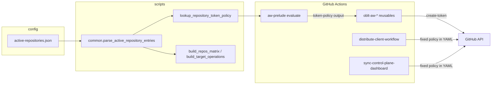

## Summary

Move per-repository GitHub token policy selection into control-plane configuration (`config/<org>/active-repositories.json`) for **prelude-driven** observability workflows. The `aw-prelude` reusable workflow exposes a `token-policy` output; listed `oblt-aw-*` reusables branch between explicit Backstage policy and Vault auto policy when config is empty.

**Not in this branch:** wiring config into `distribute-client-workflow` or `sync-control-plane-dashboard` — those workflows keep their existing fixed `token-policy` values in YAML.

Tracking branch: `feat/token-policy-as-config` (work in progress; not yet committed).

## Context

- **Repository:** `elastic/oblt-aw` (control plane for observability/docs agentic workflows).
- **Config files:** `config/obs/active-repositories.json`, `config/docs/active-repositories.json`.
- **Shared prelude:** `.github/workflows/aw-prelude.yml` (used by observability and docs reusables).
- **Related docs:** `docs/operations/distribute-client-workflow.md`, `docs/onboarding/registering-a-repository.md`, `docs/workflows/distribute-client-workflow.md`.

Today, prelude-consuming workflows either omit `token-policy` on `create-token` (Vault auto policy per workflow ref) or would need per-workflow edits to pin a policy. Registering a consumer still requires catalog-info `TokenPolicy` resources; this change adds an optional **central override** per repo for prelude paths. Distribution and dashboard sync are unchanged at the workflow layer.

## Opportunity

Operators need a single, reviewable place to pin which Backstage token policy applies to a registered repository across **prelude-driven** control-plane workflows—without editing multiple workflow files per repo. Matrix builders still carry `token-policy` in JSON for consistency and future workflow use; distribute/sync jobs do not read it yet.

## Proposal

1. **Config schema** — Require object entries in `active-repositories.json`:

   ```json
   { "repository": "elastic/<repo>", "token-policy": "" }
   ```

   Non-empty `token-policy` selects an explicit Backstage policy for prelude `create-token` on that repository. Empty string keeps Vault auto policy on consumer triggers.

2. **Parsing and validation** (`scripts/common.py`) — Add `ActiveRepositoryEntry`, `parse_active_repository_entries`, `merge_repository_token_policies_from_org_trees`, and `lookup_repository_token_policy`. Detect duplicate repos with conflicting policies within a file or across org trees.

3. **CI scripts**
   - `scripts/resolve_repository_token_policy.py` — Resolve policy for `TARGET_REPOSITORY` / `--repository` into `GITHUB_OUTPUT`.
   - `scripts/build_repos_matrix.py` — Include `token-policy` on each matrix `repos` entry (unused by `sync-control-plane-dashboard` today).
   - `scripts/build_target_operations.py` — Include `token-policy` on install/remove matrix targets (unused by `distribute-client-workflow` today).

4. **`aw-prelude`** — Sparse-checkout `resolve_repository_token_policy.py`; run resolve step; expose `token-policy` workflow output.

5. **Prelude workflow consumers** — Split `create-token` into explicit-policy vs auto-policy steps in:
   - `oblt-aw-automerge.yml`
   - `oblt-aw-dependency-review.yml`
   - `oblt-aw-security-detector.yml`
   - `oblt-aw-security-triage.yml`
   - `oblt-aw-resource-not-accessible-by-integration-triage.yml`

6. **Unchanged workflows** — `distribute-client-workflow.yml` (`token-policy-63405ab45244`), `sync-control-plane-dashboard.yml` (`token-policy-8b60ba56dd3f`).

7. **Docs and tests** — Object-only config contract; document that distribute/sync keep fixed policies; extend `tests/test_build_repos_matrix.py` and `tests/test_org_config.py`.

## Design



| Workflow | Token policy source (this branch) |
|----------|-----------------------------------|
| Prelude-consuming `oblt-aw-*` listed above | Config via `aw-prelude` when non-empty; else Vault auto |
| `distribute-client-workflow.yml` | Fixed `token-policy-63405ab45244` (unchanged) |
| `sync-control-plane-dashboard.yml` | Fixed `token-policy-8b60ba56dd3f` (unchanged) |

## Scope

| In scope | Out of scope |
|----------|----------------|
| Object-shaped `active-repositories.json` for `obs` and `docs` org trees | `distribute-client-workflow` / `sync-control-plane-dashboard` reading config policy |
| Prelude output + resolve script | Changing client template entrypoints under `.github/remote-workflow-template/` |
| Prelude `create-token` branching in five listed workflows | Migrating every consumer repo’s catalog-info policies |
| Matrix JSON includes `token-policy` from scripts (forward-compatible) | Removing legacy string-list parsing in scripts (strings still accepted in parser) |
| Unit tests and control-plane docs | Editing distributed copies in target repos (distribution handles that) |

## Implementation notes

1. **`scripts/common.py`** — Dataclass `ActiveRepositoryEntry`; object/string entry parsing; merge and lookup helpers with conflict detection.

2. **`scripts/resolve_repository_token_policy.py`** (new) — CLI for prelude evaluate job.

3. **`.github/workflows/aw-prelude.yml`** — Sparse-checkout new script; `Resolve repository token policy` step; workflow/job outputs.

4. **`config/obs/active-repositories.json`**, **`config/docs/active-repositories.json`** — Migrate all entries to `{ "repository", "token-policy": "" }`.

5. **`scripts/build_repos_matrix.py`**, **`scripts/build_target_operations.py`** — Attach `token-policy` to matrix rows (workflows do not consume for distribute/sync in this branch).

6. **Prelude consumers** (split `create-token` steps): `oblt-aw-automerge.yml`, `oblt-aw-dependency-review.yml`, `oblt-aw-security-detector.yml`, `oblt-aw-security-triage.yml`, `oblt-aw-resource-not-accessible-by-integration-triage.yml`.

7. **Docs** — `docs/onboarding/registering-a-repository.md`, `docs/operations/distribute-client-workflow.md`, `docs/workflows/distribute-client-workflow.md` (note fixed policies on distribute/sync).

8. **Tests** — `tests/test_build_repos_matrix.py`, `tests/test_org_config.py`.

## Acceptance criteria

- [ ] Every `config/*/active-repositories.json` entry uses `{ "repository": "owner/repo", "token-policy": "<string>" }`.
- [ ] `aw-prelude` exposes `token-policy` (empty when unset for the calling repository).
- [ ] `python scripts/build_repos_matrix.py` emits matrix objects including `token-policy`.
- [ ] `build_target_operations.py` matrix targets include `token-policy` (may be unused by distribute workflow in this branch).
- [ ] Listed prelude workflows use configured policy when non-empty and Vault auto policy when empty.
- [ ] `distribute-client-workflow` and `sync-control-plane-dashboard` behavior unchanged (fixed YAML policies).
- [ ] Conflicting non-empty policies for the same repo across org trees fail fast in scripts/CI.
- [ ] `pytest tests/test_build_repos_matrix.py tests/test_org_config.py` passes.
- [ ] Onboarding and operations docs describe the object-only contract and prelude vs distribute/sync policy behavior.

## Validation

```bash
cd elastic/oblt-aw
pytest tests/test_build_repos_matrix.py tests/test_org_config.py -q
python scripts/build_repos_matrix.py
```

After merge, smoke-test a prelude workflow on a repo with empty policy (unchanged) and optionally with a non-empty policy (explicit `create-token` path).

## Risks and mitigations

| Risk | Mitigation |
|------|------------|
| Wrong policy in config grants excessive GitHub permissions | PR review; policy names must exist in catalog-info; empty string preserves Vault auto on prelude paths |
| Cross-org duplicate repo with different policies | `merge_repository_token_policies_from_org_trees` exits with clear error |
| `token-policy` on matrix rows but unused by distribute/sync | Documented; follow-up can wire workflows without config schema churn |
| Breaking JSON shape for external tooling | Parser still accepts legacy string entries during migration; config files migrated in-repo |

## Open questions

- Should any obs/docs repos ship with **non-empty** `token-policy` in the initial migration, or all `""` until catalog policies are aligned per repo?
- Follow-up issue to wire `distribute-client-workflow` and `sync-control-plane-dashboard` to config (revert of that work was intentional for this PR)?

## References

- Branch: `feat/token-policy-as-config`
- Files touched (uncommitted): **16 modified** + `scripts/resolve_repository_token_policy.py` (new)
- **Reverted / not in branch:** `.github/workflows/distribute-client-workflow.yml`, `.github/workflows/sync-control-plane-dashboard.yml`
- `elastic/oblt-actions` `github/create-token@v1` — explicit `token-policy` vs Vault auto role
