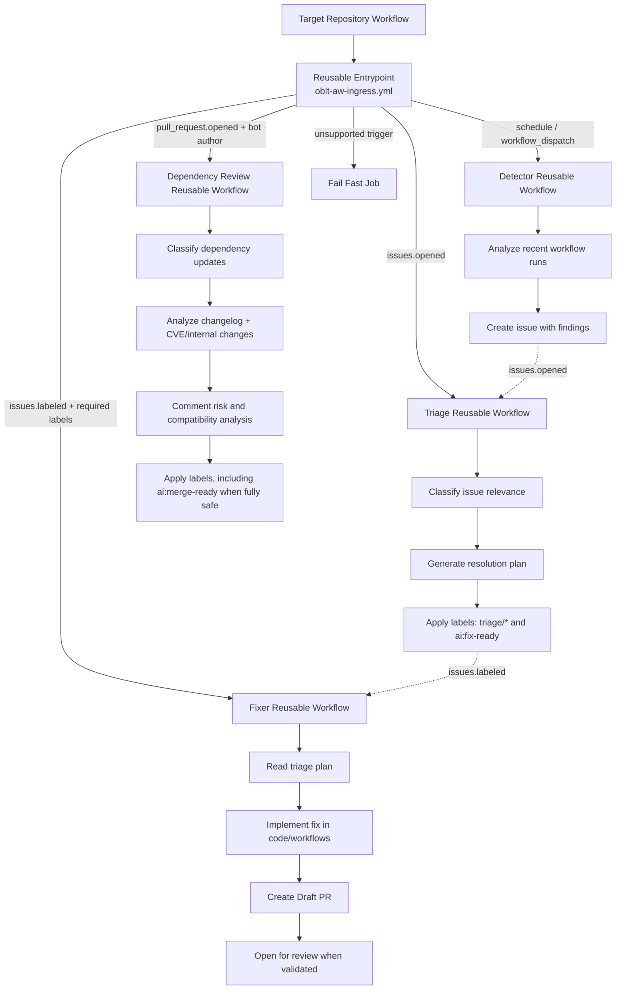

# OBLT Agentic Workflows (`oblt-aw`)

This repository is the **central catalog of reusable agentic workflows** for Observability automation.

Its main objective is to provide a **single reusable entry point** for consuming repositories, while keeping each automation capability isolated in specialized reusable workflows.

---

## Why this repository exists

In consumer repositories, wiring multiple automation workflows directly creates drift and duplication:

- each repository must know which reusable workflow to call
- trigger/event wiring can diverge across repositories
- onboarding new workflows requires repetitive updates everywhere

`oblt-aw` solves this by exposing one reusable orchestrator:

- `.github/workflows/oblt-aw-ingress.yml`

That orchestrator routes execution to a specific specialized workflow based on GitHub event context.

---

## Core design principles

- **Single entry point** for target repositories.
- **Event-driven routing** in one place.
- **Capability isolation** (detector / triage / fixer are independent reusable workflows).
- **Least surprise for consumers**: caller workflows do not need to understand internal implementation details.
- **Future extensibility**: new capabilities can be added behind the same entrypoint contract.

---

## Current capabilities

This repository currently manages the **Resource not accessible by integration** automation chain:

1. **Detector**
   - scans recent workflow runs
   - identifies occurrences of `Resource not accessible by integration`
   - creates structured issue(s)

2. **Triage**
   - reacts to new issues
   - classifies whether issue belongs to this problem space
   - produces a resolution plan and labels for downstream automation

3. **Fixer**
   - reacts when issue is ready to be fixed
   - implements the triage plan
   - opens/updates PR with required changes and review assignment

And includes an event-driven **Dependency Review** agentic workflow:

4. **Dependency Review (Dependabot/Renovate/updatecli PRs)**
  - analyzes dependency update PRs across ecosystems
  - extends analysis with CVE/changelog/internal-change impact assessment
  - adds `ai:merge-ready` when analysis is fully successful (no risk, no breaking changes, ecosystem checks pass)

---

## Repository organization

```text
.
├── active-labels.json
├── active-repositories.json
├── .github/
│   ├── remote-workflow-template/
│   │   └── oblt-aw.yml
│   ├── workflows/
│   │   ├── oblt-aw-ingress.yml
│   │   ├── distribute-client-workflow.yml
│   │   ├── gh-aw-dependency-review.yml
│   │   ├── gh-aw-resource-not-accessible-by-integration-detector.yml
│   │   ├── gh-aw-resource-not-accessible-by-integration-triage.yml
│   │   └── gh-aw-resource-not-accessible-by-integration-fixer.yml
│   └── workflow-routing/
│       ├── dependency-review/
│       │   └── README.md
│       └── resource-not-accessible-by-integration/
│           └── README.md
├── catalog-info.yaml
└── renovate.json
```

### Folder responsibilities

- `.github/workflows/`
  - executable reusable workflows
  - includes both orchestrator and capability workflows

- `.github/workflow-routing/`
  - domain-level routing and operational notes
  - intended for documentation and conventions by workflow family

- `catalog-info.yaml`
  - service/component metadata for cataloging

- `renovate.json`
  - dependency/automation maintenance policies

---

## Entrypoint routing behavior

`oblt-aw-ingress.yml` is invoked via `workflow_call` and routes internally:

- `schedule` or `workflow_dispatch` → detector workflow
- `issues` + `opened` → triage workflow
- `issues` + `labeled` + labels (`ai:fix-ready` and `triage/resource-not-accessible-by-integration`) → fixer workflow
- `pull_request` + (`opened` / `synchronize` / `reopened`) + author (`dependabot[bot]` / `renovate[bot]` / `elastic-vault-github-plugin-prod[bot]`) → dependency review workflow
- unsupported event/action combinations fail fast in `unsupported-trigger`

This design ensures consumers integrate once and keep trigger-based behavior centralized.

---

## Agentic workflow structure (diagram)



---

## Consumption model for target repositories

Target repositories should reference only:

- `elastic/oblt-aw/.github/workflows/oblt-aw-ingress.yml@main`

This keeps consumers decoupled from specialized workflow file names and internal orchestration logic.

## Fleet rollout to many repositories

To scale adoption without manually adding workflows in each target repository, this repo now includes a distribution mechanism:

- Source client workflow template:
  - `.github/remote-workflow-template/oblt-aw.yml`
- Target repository inventory:
  - `active-repositories.json`
- PR distribution workflow:
  - `.github/workflows/distribute-client-workflow.yml`

How it works:

1. `distribute-client-workflow.yml` runs on push to `main` only when one of these files changes:
  - `active-repositories.json`
  - `.github/remote-workflow-template/oblt-aw.yml`
2. It can also be run manually via `workflow_dispatch` with optional input:
  - `force` (`true`/`false`, default `false`)
  - When `force=true`, distribution runs even if no relevant files changed.
3. It uses `elastic/oblt-actions/github/changed-files@v1` to gate target preparation for `push` events.
4. It reads repositories from `active-repositories.json` and compares them with the previous revision.
5. For repositories present in the current list, it creates/updates:
  - `.github/workflows/oblt-aw.yml`
6. For repositories removed from the list, it opens a PR that removes:
  - `.github/workflows/oblt-aw.yml`
7. It opens a PR (or updates the branch if one already exists) in each affected repository.

### Token policy requirement

The distribution workflow generates the GitHub token at runtime using:

- `elastic/oblt-actions/github/create-token@v1`

Set repository variable `OBLT_AW_TOKEN_POLICY` with the token policy name.

The resulting ephemeral token must have permissions required to:

- clone target repositories
- push a branch
- create pull requests

Reference: https://docs.elastic.dev/platform-engineering-productivity/services/ephemeral-tokens/github-actions

---

## Operational notes

- The specialized workflows (`detector`, `triage`, `fixer`) define optional `target-repositories` filters for direct invocation scenarios.
- The main entrypoint currently routes by trigger/action and does not expose those filter inputs.
- Permissions are explicitly declared per workflow to align with least-privilege operation.

---

## How to extend this repository

When adding a new agentic capability:

1. Create a new reusable workflow under `.github/workflows/` for that capability.
2. Add routing condition(s) in `oblt-aw-ingress.yml` to dispatch to it.
3. Add/update documentation under `.github/workflow-routing/<domain>/`.
4. Keep consumer repositories unchanged whenever possible (single-entrypoint contract).

This approach preserves consistency across all target repositories while allowing internal evolution.
