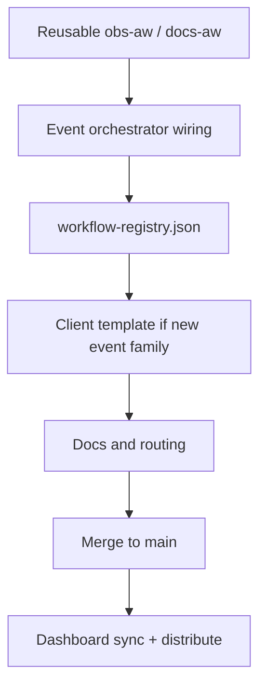

# Add a new agentic workflow

## Overview

You are shipping a **new** routed workflow in the `elastic/oblt-aw` framework so consumer repositories can enable it from the Control Plane dashboard.

This is the maintainer path. Repo owners who only need to **enable** an existing agentic workflow should use [Enable or disable an agentic workflow](../user-guide/enable-a-new-workflow.md).



## Prerequisites

- Permission to change `elastic/oblt-aw` on `main` via reviewed pull requests.
- When the agent graph lives in **`elastic/ai-github-actions`**, access to add or update the pinned `gh-aw-*.lock.yml` wrapper there.

## Steps

Follow the framework checklist in [Adopting a new remote agentic workflow](../onboarding/adopting-agentic-workflows.md#framework-checklist-elasticoblt-aw):

1. **Add reusable workflows** — Framework wrapper (`obs-aw-<name>.yml` or `docs-aw-<name>.yml`) and, when applicable, a thin wrapper that calls the pinned lock file from `elastic/ai-github-actions`.

2. **Add route contract and event orchestration** — Route reusables declare `shared-proceed`; event orchestrators (`obs-aw-event-*.yml`) call [aw-prelude](../workflows/aw-prelude.md) once and fan out. Add your route basename to the matching orchestrator’s `control-plane-workflows` input when the GitHub event family already exists. Route workflows must not call `aw-prelude` directly.

3. **Register in `workflow-registry.json`** — Add `id`, `name`, `description`, `maturity`, `default_enabled`, `docs` (any repo-relative documentation path; usually under `docs/workflows/`, sometimes a user-guide page such as `docs/user-guide/automerge-services.md`), and `inner_workflows` under `config/<org-key>/`.

   Example shape from [config/obs/workflow-registry.json](https://github.com/elastic/oblt-aw/blob/main/config/obs/workflow-registry.json) (adapt fields for the new id):

   ```json
   {
     "id": "issue-triage",
     "name": "Issue Triage",
     "description": "Triages newly opened issues using the generic issue-triage agentic workflow.",
     "maturity": "early-adoption",
     "default_enabled": false,
     "docs": "docs/workflows/obs-aw-issue-triage.md",
     "inner_workflows": ["obs-aw-issue-triage.yml"]
   }
   ```

4. **Wire consumer triggers** — Client templates are grouped by **GitHub event family**, not one file per workflow ([Client template index](../workflows/obs-aw-client-template.md)).
   - **Existing event family** (`pull_request`, `issues`, `issue_comment`, `schedule`, `status`, or `workflow_run`): ensure the route is wired in the matching `obs-aw-event-*.yml` orchestrator (step 2). Consumer repos already have the corresponding `trigger-obs-aw-*.yml` — **no new client template**.
   - **New event family**: add a `trigger-obs-aw-*.yml` under `.github/remote-workflow-template/<org-key>/.github/workflows/` and a matching `obs-aw-event-*.yml` orchestrator in the framework.

5. **Update documentation** — `docs/workflows/obs-aw-<name>.md`, routing doc when triggers are non-trivial, and [docs/workflows/README.md](../workflows/index.md).

6. **Validate and merge** — CI must pass. After merge, [sync-control-plane-dashboard](../workflows/sync-control-plane-dashboard.md) adds the new checkbox to consumer Control Plane dashboards.

7. **Consumer adoption** — Registered repos receive template updates via [distribute-client-workflow](../operations/distribute-client-workflow.md). Users enable the agentic workflow from the Control Plane dashboard ([Enable or disable an agentic workflow](../user-guide/enable-a-new-workflow.md)).

   :::{image} ../images/control-plane-dashboard-issue.png
   :alt: Control Plane dashboard catalog table after sync adds a new workflow row
   :screenshot:
   :::

When a workflow calls `gh-aw-*`, each agent job must invoke [aw-resolve-agentic-assets](../workflows/aw-resolve-agentic-assets.md) immediately before the lock file (enforced by CI).

## See also

- [Adopting a new remote agentic workflow](../onboarding/adopting-agentic-workflows.md) — full checklist and consumer section
- [Contributing to oblt-aw](../development/contributing.md) — local setup and pre-commit
- [Change maturity level](change-maturity-level.md)
- [Use GitHub ephemeral tokens](use-gh-ephemeral-tokens.md)
