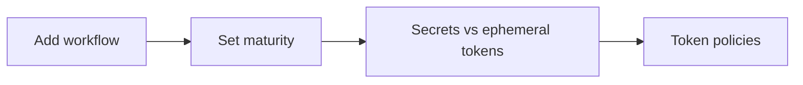

# Admin guide

Procedures for **framework maintainers** — people who change [`elastic/oblt-aw`](https://github.com/elastic/oblt-aw) or related agentic assets (new workflows, maturity, secrets, ephemeral tokens, promote and rollback). This is not the GitHub Admin role on a target repository.

Target repository owners who only enable or disable existing workflows should use the [User guide](../user-guide/index.md).

## Maintain the framework

| Goal | Guide |
|------|--------|
| Ship a new routed workflow in the framework | [Add a new agentic workflow](add-a-new-agentic-workflow.md) |
| Change maturity or Control Plane dashboard sync behavior | [Change maturity level](change-maturity-level.md) |
| Decide if a repository secret is required vs ephemeral tokens | [Configure a GitHub secret](configure-a-github-secret.md) |
| Use ephemeral tokens and token policies | [Use GitHub ephemeral tokens](use-gh-ephemeral-tokens.md) |
| Promote a new framework release (version bump) | [Release](../knowledge-base/release.md) ([promote runbook](../operations/release-model.md#promote-contract)) |
| Roll back a recent framework release | [Release](../knowledge-base/release.md) ([rollback runbook](../operations/release-model.md#quick-rollback)) |
| Contribute to `elastic/oblt-aw` (local setup, pre-commit) | [Contributing](../development/contributing.md) |

## Related

- Long-form adoption checklist: [Adopting a new remote agentic workflow](../onboarding/adopting-agentic-workflows.md)
- Technical registration contract: [Registering resources](../onboarding/registering-a-repository.md)
- [Knowledge base](../knowledge-base/index.md) — Agentic Workflows, architecture, release, and QA
- [Release](../knowledge-base/release.md) — promote train, pins, and rollback
