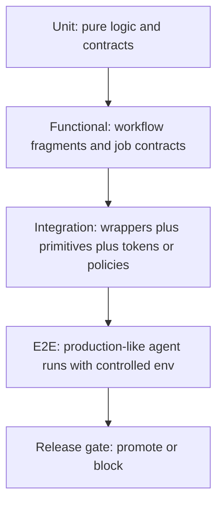
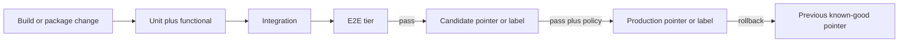

# Agentic workflow testing platform (design)

**Status:** Design for [#1877](https://github.com/elastic/oblt-aw/issues/1877) (parent [#1879](https://github.com/elastic/oblt-aw/issues/1879)).  
**Hosting decision:** Implement the platform **inside `elastic/oblt-aw`** for the first vertical slice and near-term layers. Revisit a dedicated repository only if E2E harness size, shared multi-org consumers, or cross-catalog ownership outgrow this repo.  
**First vertical slice:** `obs:estc-pr-buildkite-detective` (status path → wrapper → in-repo lock).

This document defines test layers (unit through E2E), how to stabilize stochastic agent runs, how release promotion consumes results (contract for [#1878](https://github.com/elastic/oblt-aw/issues/1878)), and an executable checklist for the first vertical slice. It does **not** ship the full platform in one change.

## Overview

Agentic workflows in `oblt-aw` combine deterministic control-plane logic (prelude, registries, fragment composition, validators) with stochastic agent execution (model output, tool use). Conventional CI already covers much of the deterministic surface via `pytest`, TypeScript unit tests, and workflow validators in [`.github/workflows/ci.yml`](../../.github/workflows/ci.yml). It does **not** yet prove production-like agent paths end to end.

The testing platform goal: recreate environment and inputs carefully enough that regressions are detectable, without requiring bit-identical LLM free text.

## Prerequisites

- Familiarity with [architecture overview](overview.md), [CI workflow docs](../workflows/ci.md), and [aw-prelude](../workflows/aw-prelude.md).
- Sibling tracks: primitive migration [#1876](https://github.com/elastic/oblt-aw/issues/1876), release design [#1878](https://github.com/elastic/oblt-aw/issues/1878).

## Layer definitions

Each layer owns a distinct proof. Higher layers must not replace lower ones.

| Layer | What it proves | Primary ownership today | Where it runs |
|-------|----------------|-------------------------|---------------|
| **Unit** | Pure functions and scripts behave for known inputs/outputs (gates, registry, fragment merge, dashboard parse, TS helpers). | `tests/*.py`, `tests/unit/*.test.ts` | Every PR (`python-tests`, `typescript-tests` in `ci.yml`) |
| **Functional** | Workflow YAML and GH-AW contracts hold: prelude/`shared-proceed`, resolve-agentic-assets on `gh-aw-*` callers, reusable permissions alignment, actionlint/pre-commit. | `scripts/validate_aw_workflow_*.py`, pre-commit | Every PR |
| **Integration** | Wrapper ↔ lock ↔ token/policy/fragment wiring works together without a live model (or with mocked/stubbed agent steps). Frozen fixtures for inputs, secrets shapes, and resolved instruction layers. | Not yet a dedicated suite — **to build** | PR for cheap checks; candidate promote for heavier fixtures |
| **E2E** | Production-like path: client/orchestrator routing, prelude gate, resolve assets, agent job, observable side effects under a controlled consumer environment. | `tests/e2e/` (harness/oracle unit coverage) + scheduled/manual live workflow for Buildkite detective | Promote paths and/or scheduled suites — **not** every PR by default |

### Unit (existing baseline)

Examples of what unit tests already cover (non-exhaustive):

- Dashboard enablement and gate evaluation (`test_get_enabled_workflows.py`, `test_evaluate_workflow_gates.py`)
- Instruction fragments and APM asset resolution (`test_instruction_fragments.py`, `test_apm_agentic_assets.py`)
- Registry and org config (`test_workflow_registry.py`, `test_org_config.py`)
- Distribution helpers (`test_build_repos_matrix.py`, `test_build_target_operations.py`)
- TypeScript helpers under `tests/unit/` (for example automerge validation)

**Assert:** deterministic equality and typed errors. No live GitHub agent runs.

### Functional (existing baseline)

CI steps beyond pytest:

- `python scripts/validate_aw_workflow_prelude.py`
- `python scripts/validate_aw_workflow_resolve_agentic_assets.py`
- `python scripts/validate_aw_workflow_permissions.py`
- Pre-commit (yamllint, actionlint, ruff, mypy on `scripts/`, and related hooks)

**Assert:** static/contract properties of workflow graphs and permissions. Still no live agent.

### Integration (to design and implement)

Scope for this layer:

- Compose wrapper inputs from fixtures that mimic `aw-resolve-agentic-assets` outputs (`additional-instructions`, `setup-commands`, layer JSON).
- Validate lock `workflow_call` inputs required by wrappers remain satisfied after fragment or interface changes.
- Exercise token-policy resolution paths with **fixture policy names** and dry-run or mocked `create-token` where the repository already supports testing without minting real credentials.
- Prefer recorded GitHub API fixtures over live calls when asserting wrapper orchestration scripts.

**Assert:** wiring and contracts across multiple modules. Agent model calls remain stubbed or skipped.

### End-to-end (to design and implement)

Scope for this layer:

- Run the real status → `trigger-obs-aw-status` → `obs-aw-event-status` → `obs-aw-estc-pr-buildkite-detective` → in-repo `gh-aw-estc-pr-buildkite-detective.lock.yml` path against **`elastic/oblt-aw`** (this slice’s production consumer).
- Control environment: pinned model settings from [`.github/workflows/gh-aw-fragments/obs-defaults.md`](../../.github/workflows/gh-aw-fragments/obs-defaults.md), frozen instruction fragments, dynamic intentional Buildkite failure via `BUILDKITE_TOKEN` + [`catalog-info.yaml`](../../catalog-info.yaml) pipeline `oblt-aw-e2e-estc-fail` with `publish_commit_status` (optional URL override `E2E_ESTC_BUILDKITE_TARGET_URL`), dashboard checkbox enabled for `obs:estc-pr-buildkite-detective`.
- Capture artifacts: workflow run URL, agent job logs (redacted), resulting PR comment or issue side effects, structured safe-outputs if present.

**Assert:** using the oracle strategy below — never free-text equality of the full agent narrative.

## Stochastic E2E: environment recreation and oracles

### Environment recreation

| Dimension | Approach |
|-----------|----------|
| **Prompts / fragments** | Pin fragment files and `obs-defaults` used by the slice; record resolved instruction layer list in the E2E artifact. |
| **Inputs** | Fixture status event (or replayable synthetic failure) with stable Buildkite context strings. |
| **Consumer repo** | Dedicated sandbox repository (name **Unknown** until follow-up selects it). Not a production active-repositories target used by customers. |
| **Tokens** | Ephemeral tokens via existing create-token / policy patterns where required; least privilege; no long-lived PATs in fixtures. Exact policy names **Unknown** until inventory. |
| **Runners / isolation** | GitHub-hosted runners unless a follow-up proves a need for larger/self-hosted. No shared mutable state across E2E jobs. |
| **Network / tools** | Allow only tools the workflow already declares; prefer recorded Buildkite log payloads over live org scraping when possible. |
| **Model** | Same model defaults as production fragments for the slice, unless a cheaper deterministic stub is explicitly introduced for a non-agent subpath. Document any deliberate drift. |

### Oracle strategy (mandatory)

Prefer stronger, cheaper checks first:

1. **Deterministic path checks** — job reaches agent stage; `shared-proceed` true; resolve-agentic-assets succeeds; lock completes without infrastructure failure.
2. **Structured side effects** — expected GitHub object exists (for example a PR comment with a stable marker, or an issue with required labels/title prefix `[oblt-aw]`). Exact prose is not compared.
3. **Schema / structured outputs** — when the lock emits safe-outputs or JSON-like fields, validate against an explicit schema or required keys.
4. **Rubric (optional, later)** — lightweight checklist scored by a separate deterministic script or human gate for promote-critical slices only.
5. **Golden free-text** — **out of scope**. Bit-identical LLM text is a non-goal ([#1877](https://github.com/elastic/oblt-aw/issues/1877)).

Flaky cases: quarantine with an owner; do not silently retry into green. Retries only as a documented temporary mitigation.

## Hosting decision

**Decision:** Keep the testing platform in **`elastic/oblt-aw`**.

| Option | Verdict |
|--------|---------|
| **Inside `oblt-aw`** | **Chosen.** Unit and functional suites, CI validators, in-repo GH-AW pilot (`gh-aw-estc-pr-buildkite-detective`), and docs already live here. |
| **New dedicated repo** | Deferred. Reconsider if E2E harness becomes a shared product across catalogs outside Observability ownership, or if repo size/noise justifies a split. |
| **Elsewhere (for example only in `ai-github-actions`)** | Rejected for Observability-owned wrappers and control-plane contracts; those assets are authored and gated here. |

Primitive migration ([#1876](https://github.com/elastic/oblt-aw/issues/1876)) may move more locks into this repo; colocating tests with that ownership reduces cross-repo friction.

## Release consumption contract

This section is the test-side interface for [#1878](https://github.com/elastic/oblt-aw/issues/1878). Release tagging/pointer mechanics stay in that issue; promote/block **signals** are defined here.

| Gate | Required layers | Typical trigger | On failure |
|------|-----------------|-----------------|------------|
| **Merge to `main`** | Unit + functional (current `ci.yml` required job) | Every PR | Block merge |
| **Candidate promote** | Merge gates + integration suite for touched workflows | Release automation / manual promote ([#1878](https://github.com/elastic/oblt-aw/issues/1878)) | Block candidate pointer update |
| **Production promote** | Candidate gates + E2E tier for in-scope workflows (sampled or full per cost policy) | Promote train | Block production pointer; keep previous known-good |
| **Rollback** | N/A (operational) | On-call / release owner | Point back to previous known-good; re-run smoke E2E optional |

**Artifacts (minimum):**

- Pass/fail boolean per layer and per workflow id under test
- Workflow run URLs for integration/E2E
- Oracle report (which checks ran, which passed)
- Quarantine list (if any cases skipped)

**Cost control:** E2E is tiered — default off on PRs; on for promote or schedule. Expand suite only when oracles are stable.

Exact workflow file names for promote jobs are **Unknown** until #1878 implementation; this contract only requires that promote steps consume the signals above.

## First vertical slice: `estc-pr-buildkite-detective`

### Why this slice

- In-repo primitive pilot; wrapper already pins `elastic/oblt-aw/.../gh-aw-estc-pr-buildkite-detective.lock.yml`.
- Workflow doc explicitly tracks missing E2E under [#1877](https://github.com/elastic/oblt-aw/issues/1877).
- Side effects are observable (PR comment / investigation outcome) without needing the full security or autodoc surface area.

### Acceptance criteria for the slice (implementation follow-ups)

1. Integration fixtures cover resolve → wrapper input mapping for this workflow.
2. Production E2E on **`elastic/oblt-aw`** exercises intentional Buildkite failure → Buildkite-published status → detective agent (or optional URL override with harness-posted status).
3. Oracles: infrastructure success + structured side-effect check (stable marker or schema); no full free-text golden file.
4. Results publish as artifacts / `workflow_call` outputs consumable by a future #1878 promote job.
5. Docs updated: this design remains authoritative; workflow doc links here instead of “not covered”.

### Follow-up issues

- Integration fixtures: [#1910](https://github.com/elastic/oblt-aw/issues/1910)
- E2E harness and oracles: [#1911](https://github.com/elastic/oblt-aw/issues/1911)

### Implementation checklist

- [x] Inventory secrets for live E2E (`BUILDKITE_LOGS_API_TOKEN` via client trigger; `BUILDKITE_TOKEN` + intentional-failure pipeline; optional URL override). See [estc-pr-buildkite-detective-e2e](../testing/estc-pr-buildkite-detective-e2e.md). ([#1911](https://github.com/elastic/oblt-aw/issues/1911))
- [x] Use **`elastic/oblt-aw`** as the E2E consumer (no separate sandbox). Enable `obs:estc-pr-buildkite-detective` on its Control Plane Dashboard before live runs. ([#1911](https://github.com/elastic/oblt-aw/issues/1911))
- [ ] Add resolve→wrapper integration suite ([#1910](https://github.com/elastic/oblt-aw/issues/1910)). Fixture/integration case inputs live under `testdata/agentic/estc-pr-buildkite-detective/`.
- [x] Add E2E workflow [`.github/workflows/aw-e2e-estc-pr-buildkite-detective.yml`](../../.github/workflows/aw-e2e-estc-pr-buildkite-detective.yml) (`workflow_dispatch` + weekly schedule + `workflow_call` for #1878); kept out of default PR `required`. ([#1911](https://github.com/elastic/oblt-aw/issues/1911))
- [x] Implement oracle script(s) that assert structured outcomes and emit a machine-readable report (`scripts/oracle_estc_pr_buildkite_detective_e2e.py`). ([#1911](https://github.com/elastic/oblt-aw/issues/1911))
- [x] Wire artifact upload + `outputs.pass`; document how #1878 promote reads pass/fail (`summary.json` / `oracle-report.json`). ([#1911](https://github.com/elastic/oblt-aw/issues/1911))
- [x] Quarantine policy: [`config/obs/e2e-quarantine.json`](../../config/obs/e2e-quarantine.json) with default owner `@elastic/observablt-robots`. ([#1911](https://github.com/elastic/oblt-aw/issues/1911))
- [x] Update [obs-aw-estc-pr-buildkite-detective](../workflows/obs-aw-estc-pr-buildkite-detective.md) when the first E2E job lands. ([#1911](https://github.com/elastic/oblt-aw/issues/1911))

## Non-goals

- Shipping the full multi-workflow E2E matrix in one change.
- Guaranteeing bit-identical LLM output.
- Finalizing release pointer/tag mechanics ([#1878](https://github.com/elastic/oblt-aw/issues/1878)).
- Completing primitive migration ([#1876](https://github.com/elastic/oblt-aw/issues/1876)).

## Open questions (remaining unknowns)

Resolved by this design where noted; remaining items are for implementation issues:

| Topic | Status |
|-------|--------|
| Platform home | **Resolved:** `elastic/oblt-aw` |
| First E2E vertical slice | **Resolved:** `obs:estc-pr-buildkite-detective` |
| Oracle strategy | **Resolved:** structured side effects + schema; no free-text golden |
| E2E consumer repository | **Resolved:** `elastic/oblt-aw` (no separate sandbox for this slice) |
| Exact credentials, runners, and isolation inventory | **Resolved for live:** `BUILDKITE_LOGS_API_TOKEN` + `BUILDKITE_TOKEN` + intentional-failure pipeline; dashboard checkbox must be enabled |
| How closely E2E must match production models/tools | **Resolved policy:** match production fragment defaults for the slice; document any intentional drift; prefer recorded Buildkite payloads when live access is costly or unstable |
| Promote workflow wiring | **Unknown** — owned with [#1878](https://github.com/elastic/oblt-aw/issues/1878) |

## References

- Issue: [Design testing platform for agentic workflows (#1877)](https://github.com/elastic/oblt-aw/issues/1877)
- Parent: [Simplify agentic workflow ownership, contracts, release, and testing (#1879)](https://github.com/elastic/oblt-aw/issues/1879)
- Release sibling: [#1878](https://github.com/elastic/oblt-aw/issues/1878)
- Migrate sibling: [#1876](https://github.com/elastic/oblt-aw/issues/1876)
- CI: [docs/workflows/ci.md](../workflows/ci.md), [`.github/workflows/ci.yml`](../../.github/workflows/ci.yml)
- Slice workflow: [obs-aw-estc-pr-buildkite-detective.md](../workflows/obs-aw-estc-pr-buildkite-detective.md)
- E2E harness (slice): [estc-pr-buildkite-detective-e2e.md](../testing/estc-pr-buildkite-detective-e2e.md)
- Local checks: [docs/development/contributing.md](../development/contributing.md)
