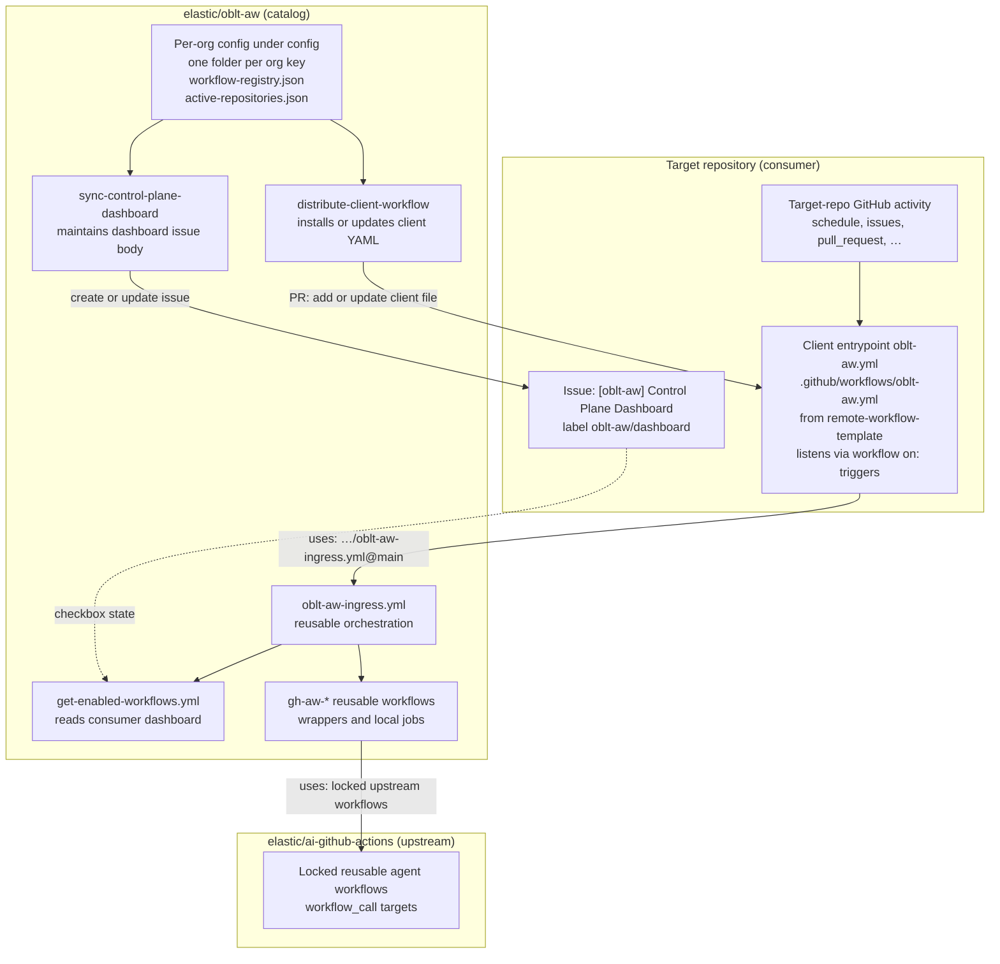
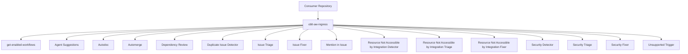

# OBLT AW Architecture Overview

## Overview

`oblt-aw` exposes a single reusable entrypoint workflow and routes execution to specialized workflows by GitHub event context.

Entrypoint workflows:

- [.github/workflows/oblt-aw-ingress.yml](../../.github/workflows/oblt-aw-ingress.yml) (orchestration)
- [.github/workflows/get-enabled-workflows.yml](../../.github/workflows/get-enabled-workflows.yml) (dashboard read; first stage inside ingress)

Specialized workflows:

- [.github/workflows/gh-aw-agent-suggestions.yml](../../.github/workflows/gh-aw-agent-suggestions.yml)
- [.github/workflows/gh-aw-autodoc.yml](../../.github/workflows/gh-aw-autodoc.yml)
- [.github/workflows/gh-aw-automerge.yml](../../.github/workflows/gh-aw-automerge.yml)
- [.github/workflows/gh-aw-dependency-review.yml](../../.github/workflows/gh-aw-dependency-review.yml)
- [.github/workflows/gh-aw-duplicate-issue-detector.yml](../../.github/workflows/gh-aw-duplicate-issue-detector.yml)
- [.github/workflows/gh-aw-issue-fixer.yml](../../.github/workflows/gh-aw-issue-fixer.yml)
- [.github/workflows/gh-aw-issue-triage.yml](../../.github/workflows/gh-aw-issue-triage.yml)
- [.github/workflows/gh-aw-mention-in-issue.yml](../../.github/workflows/gh-aw-mention-in-issue.yml)
- [.github/workflows/gh-aw-resource-not-accessible-by-integration-detector.yml](../../.github/workflows/gh-aw-resource-not-accessible-by-integration-detector.yml)
- [.github/workflows/gh-aw-resource-not-accessible-by-integration-fixer.yml](../../.github/workflows/gh-aw-resource-not-accessible-by-integration-fixer.yml)
- [.github/workflows/gh-aw-resource-not-accessible-by-integration-triage.yml](../../.github/workflows/gh-aw-resource-not-accessible-by-integration-triage.yml)
- [.github/workflows/gh-aw-security-detector.yml](../../.github/workflows/gh-aw-security-detector.yml)
- [.github/workflows/gh-aw-security-fixer.yml](../../.github/workflows/gh-aw-security-fixer.yml)
- [.github/workflows/gh-aw-security-triage.yml](../../.github/workflows/gh-aw-security-triage.yml)

## Usage

Consumer repositories integrate once using:

```yaml
jobs:
  run-aw:
    uses: elastic/oblt-aw/.github/workflows/oblt-aw-ingress.yml@main
    secrets:
      COPILOT_GITHUB_TOKEN: ${{ secrets.COPILOT_GITHUB_TOKEN }}
```

## Control Plane and Consumer Interaction Diagram

The diagram below summarizes **how operators configure the platform in `elastic/oblt-aw`**, **how automation reaches target repositories**, and **how a run in a consumer repository delegates back** into reusable workflows in this catalog. In each target repository, the **installed client entrypoint** (`.github/workflows/oblt-aw.yml`, from [`.github/remote-workflow-template/oblt-aw.yml`](../../.github/remote-workflow-template/oblt-aw.yml)) is the workflow that **declares `on:`** and **listens for repository-local events**; it then calls ingress in this catalog. Arrows show the primary direction of configuration or invocation; GitHub runs reusable workflows in the **calling repository’s context** (the consumer), while workflow **definitions** live in `elastic/oblt-aw`.



For event-level routing from ingress to individual `gh-aw-*` jobs, see the smaller routing flowchart under [Examples](#examples).

## Control Plane Dashboard

The Control Plane Dashboard provides a self-service UI for repository users to opt in or opt out of each agentic workflow. It follows a Renovate Dependency Dashboard–style UX.

### Dashboard Issue

- **Location:** A single GitHub Issue per repository, created and maintained by the control-plane
- **Title:** `[oblt-aw] Control Plane Dashboard`
- **Label:** `oblt-aw/dashboard` (used for identification and routing)
- **Content:** Workflow list with maturity badges and checkboxes for opt-in/opt-out

### Config Flow

1. **Dashboard sync** (`sync-control-plane-dashboard`): Reads per-org `config/<org-key>/workflow-registry.json` and `active-repositories.json`; creates or updates the **single** dashboard issue in each target repository with sections per org; pins the issue when possible
2. **User edit:** Users check or uncheck workflow checkboxes in the dashboard issue (no config file; no PRs on checkbox edits)
3. **Runtime check** (`get-enabled-workflows`): When the client runs the ingress, this reusable workflow runs first. It parses the dashboard (or `effective-raw` is empty when no issue exists) and emits normalized `enabled-workflows` as a compact JSON array string (`[]` or `["org:workflow-id", ...]`, for example `["obs:autodoc","obs:security"]`).
4. **Ingress gating:** Routed jobs use `enabled-workflows` and `effective-raw` from `get-enabled-workflows`; empty string (no dashboard) → all workflows; empty array → none; non-empty array → only listed workflows

### Opt-in / Opt-out

- **No dashboard exists:** All workflows are activated by default
- **Dashboard exists, all unchecked:** All workflows are deactivated
- **Dashboard exists, some checked:** Only checked workflows are executed

### References

- [docs/operations/control-plane-dashboard.md](../operations/control-plane-dashboard.md) — user instructions
- [docs/operations/control-plane-dashboard-format.md](../operations/control-plane-dashboard-format.md) — dashboard issue format
- [Multi-organization agentic workflows (design)](./multi-org-agentic-workflows.md) — parameterizing registries by `config/<org-key>/` (e.g. `config/obs/`), per-org active repositories, one shared dashboard with org-grouped workflows and org-inclusive checklist markers
- [Issue #3732 comment (implementation plan)](https://github.com/elastic/observability-robots/issues/3732#issuecomment-4054356635) — canonical plan

### Issues created by agentic workflows

Any issue opened by OBLT AW workflows must use a title that starts with `[oblt-aw]`. Wrapper workflows pass a `title-prefix` (or equivalent) to upstream agentic jobs so new issues stay searchable and consistent; the dashboard issue title is `[oblt-aw] Control Plane Dashboard`.

---

## Routing Model

Current routing conditions from [.github/workflows/oblt-aw-ingress.yml](../../.github/workflows/oblt-aw-ingress.yml):

- `schedule` -> `agent-suggestions`, `autodoc`, `resource-not-accessible-by-integration-detector`, `security-detector`
- `workflow_dispatch` -> `duplicate-issue-detector`, `security-detector`
- `pull_request` + action in `opened|synchronize|reopened` + PR author in allowlist -> `dependency-review`
- `pull_request` + action in `opened|synchronize|reopened|labeled` + PR author in allowlist + label `oblt-aw/ai/merge-ready` -> `automerge`
- `issues` + `opened` -> `duplicate-issue-detector`, `issue-triage`
- `issues` + (`opened` with label `oblt-aw/detector/res-not-accessible-by-integration` OR `labeled` with that label) -> `resource-not-accessible-by-integration-triage`
- `issues` + `labeled` + label `oblt-aw/ai/fix-ready` + triage label `oblt-aw/triage/res-not-accessible-by-integration` -> `resource-not-accessible-by-integration-fixer`
- `issues` + (`opened` with label `oblt-aw/detector/security` OR `labeled` with that label) -> `security-triage`
- `issues` + `labeled` + (`oblt-aw/ai/fix-ready` + `oblt-aw/triage/security-*` OR inverse label order) -> `security-fixer`
- `issue_comment` + `created` + issue (not PR) + `/ai implement` + author association in `OWNER|MEMBER|COLLABORATOR` + no security/resource-not-accessible triage labels -> `issue-fixer`
- `issue_comment` + `created` + issue (not PR) + `/ai` (excluding `/ai implement`) + author association in `OWNER|MEMBER|COLLABORATOR` -> `mention-in-issue`
- unsupported event/action combinations -> `unsupported-trigger` fail-fast job

*Note: Dashboard opt-in/opt-out is read at runtime inside the ingress via `get-enabled-workflows`; there is no `issues.edited` trigger.*

## Examples



*The ingress calls `get-enabled-workflows` first to read the dashboard issue; each routed job is gated by the effective `enabled-workflows` value.*

## References

- [docs/workflows/README.md](../workflows/README.md)
- [docs/routing/README.md](../routing/README.md)
