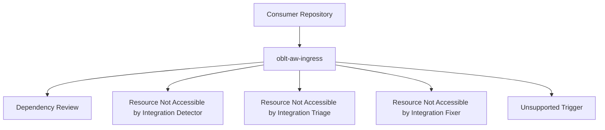

# OBLT AW Architecture Overview

## Overview

`oblt-aw` exposes a single reusable entrypoint workflow and routes execution to specialized workflows by GitHub event context.

Entrypoint workflow:

- `.github/workflows/oblt-aw-ingress.yml`

Specialized workflows:

- `.github/workflows/gh-aw-dependency-review.yml`
- `.github/workflows/gh-aw-resource-not-accessible-by-integration-detector.yml`
- `.github/workflows/gh-aw-resource-not-accessible-by-integration-triage.yml`
- `.github/workflows/gh-aw-resource-not-accessible-by-integration-fixer.yml`

## Usage

Consumer repositories integrate once using:

```yaml
jobs:
  run-aw:
    uses: elastic/oblt-aw/.github/workflows/oblt-aw-ingress.yml@main
```

## Routing Model

Current routing conditions from `.github/workflows/oblt-aw-ingress.yml`:

- `pull_request` + action in `opened|synchronize|reopened` + bot author in allowlist -> dependency review
- `schedule` or `workflow_dispatch` -> resource-not-accessible detector
- `issues` + `opened` -> resource-not-accessible triage
- `issues` + `labeled` + required labels -> resource-not-accessible fixer
- unsupported event/action combinations -> `unsupported-trigger` fail-fast job

## Examples



## References

- `docs/workflows/README.md`
- `docs/routing/README.md`
