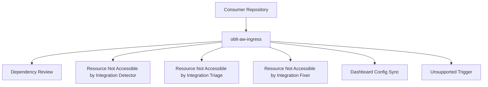

# OBLT AW Architecture Overview

## Overview

`oblt-aw` exposes a single reusable entrypoint workflow and routes execution to specialized workflows by GitHub event context.

Entrypoint workflow:

- `.github/workflows/oblt-aw-ingress.yml`

Specialized workflows:

- `.github/workflows/gh-aw-dependency-review.yml`
- `.github/workflows/gh-aw-resource-not-accessible-by-integration-detector.yml`
- `.github/workflows/gh-aw-resource-not-accessible-by-integration-triage.yml`
- `.github/workflows/gh-aw-resource-not-accessible-by-integration-fixer.yml`

## Usage

Consumer repositories integrate once using:

```yaml
jobs:
  run-aw:
    uses: elastic/oblt-aw/.github/workflows/oblt-aw-ingress.yml@main
```

## Control Plane Dashboard

The Control Plane Dashboard provides a self-service UI for repository users to opt in or opt out of each agentic workflow. It follows a Renovate Dependency Dashboard–style UX.

### Dashboard Issue

- **Location:** A single GitHub Issue per repository, created and maintained by the control-plane
- **Title:** `[OBLT AW] Control Plane Dashboard`
- **Label:** `oblt-aw/dashboard` (used for identification and routing)
- **Content:** Workflow list with maturity badges and checkboxes for opt-in/opt-out

### Config Flow

1. **Dashboard sync** (`sync-control-plane-dashboard`): Reads `workflow-registry.json` and `active-repositories.json`; creates or updates the dashboard issue in each target repository; pins the issue when possible
2. **User edit:** Users check or uncheck workflow checkboxes in the dashboard issue
3. **Config sync** (`dashboard-config-sync`): Triggered by `issues.edited` when the edited issue has label `oblt-aw/dashboard`; parses checkbox state and writes `.github/oblt-aw-config.json`
4. **Ingress gating:** The ingress reads `oblt-aw-config.json` and runs only workflows listed in `enabled_workflows`

### Opt-in / Opt-out

- **Default:** If `.github/oblt-aw-config.json` does not exist, all workflows are enabled (backward compatibility)
- **Opt-in:** Check the checkbox next to a workflow in the dashboard; config sync adds it to `enabled_workflows`
- **Opt-out:** Uncheck the checkbox; config sync removes it from `enabled_workflows`

### References

- `docs/operations/control-plane-dashboard.md` — user instructions
- `docs/operations/control-plane-dashboard-format.md` — dashboard issue format
- `docs/plans/issue-3732-control-plane-dashboard.md` — implementation plan

---

## Routing Model

Current routing conditions from `.github/workflows/oblt-aw-ingress.yml`:

- `pull_request` + action in `opened|synchronize|reopened` + bot author in allowlist -> dependency review
- `schedule` or `workflow_dispatch` -> resource-not-accessible detector
- `issues` + `opened` -> resource-not-accessible triage
- `issues` + `labeled` + required labels -> resource-not-accessible fixer
- `issues` + `edited` + label `oblt-aw/dashboard` -> dashboard-config-sync
- unsupported event/action combinations -> `unsupported-trigger` fail-fast job

## Examples



## References

- `docs/workflows/README.md`
- `docs/routing/README.md`
