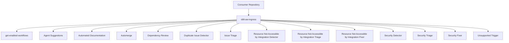

# OBLT AW Architecture Overview

## Overview

`oblt-aw` exposes a single reusable entrypoint workflow and routes execution to specialized workflows by GitHub event context.

Entrypoint workflows:

- `.github/workflows/oblt-aw-ingress.yml` (orchestration)
- `.github/workflows/get-enabled-workflows.yml` (dashboard read; first stage inside ingress)

Specialized workflows:

- `.github/workflows/gh-aw-agent-suggestions.yml`
- `.github/workflows/gh-aw-autodoc.yml`
- `.github/workflows/gh-aw-automerge.yml`
- `.github/workflows/gh-aw-dependency-review.yml`
- `.github/workflows/gh-aw-duplicate-issue-detector.yml`
- `.github/workflows/gh-aw-issue-triage.yml`
- `.github/workflows/gh-aw-resource-not-accessible-by-integration-detector.yml`
- `.github/workflows/gh-aw-resource-not-accessible-by-integration-triage.yml`
- `.github/workflows/gh-aw-resource-not-accessible-by-integration-fixer.yml`
- `.github/workflows/gh-aw-security-detector.yml`
- `.github/workflows/gh-aw-security-triage.yml`
- `.github/workflows/gh-aw-security-fixer.yml`

## Usage

Consumer repositories integrate once using:

```yaml
jobs:
  run-aw:
    uses: elastic/oblt-aw/.github/workflows/oblt-aw-ingress.yml@main
    secrets:
      COPILOT_GITHUB_TOKEN: ${{ secrets.COPILOT_GITHUB_TOKEN }}
```

## Control Plane Dashboard

The Control Plane Dashboard provides a self-service UI for repository users to opt in or opt out of each agentic workflow. It follows a Renovate Dependency Dashboard–style UX.

### Dashboard Issue

- **Location:** A single GitHub Issue per repository, created and maintained by the control-plane
- **Title:** `[oblt-aw] Control Plane Dashboard`
- **Label:** `oblt-aw/dashboard` (used for identification and routing)
- **Content:** Workflow list with maturity badges and checkboxes for opt-in/opt-out

### Config Flow

1. **Dashboard sync** (`sync-control-plane-dashboard`): Reads `workflow-registry.json` and `active-repositories.json`; creates or updates the dashboard issue in each target repository; pins the issue when possible
2. **User edit:** Users check or uncheck workflow checkboxes in the dashboard issue (no config file; no PRs on checkbox edits)
3. **Runtime check** (`get-enabled-workflows`): When the client runs the ingress, this reusable workflow runs first. It parses the dashboard (or `effective-raw` is empty when no issue exists) and emits normalized `enabled-workflows` as a compact JSON array string (`[]` or `["id", ...]`).
4. **Ingress gating:** Routed jobs use `enabled-workflows` and `effective-raw` from `get-enabled-workflows`; empty string (no dashboard) → all workflows; empty array → none; non-empty array → only listed workflows

### Opt-in / Opt-out

- **No dashboard exists:** All workflows are activated by default
- **Dashboard exists, all unchecked:** All workflows are deactivated
- **Dashboard exists, some checked:** Only checked workflows are executed

### References

- `docs/operations/control-plane-dashboard.md` — user instructions
- `docs/operations/control-plane-dashboard-format.md` — dashboard issue format
- [Issue #3732 comment (implementation plan)](https://github.com/elastic/observability-robots/issues/3732#issuecomment-4054356635) — canonical plan

### Issues created by agentic workflows

Any issue opened by OBLT AW workflows must use a title that starts with `[oblt-aw]`. Wrapper workflows pass a `title-prefix` (or equivalent) to upstream agentic jobs so new issues stay searchable and consistent; the dashboard issue title is `[oblt-aw] Control Plane Dashboard`.

---

## Routing Model

Current routing conditions from `.github/workflows/oblt-aw-ingress.yml`:

- `schedule` + dashboard allows `agent-suggestions` -> agent suggestions
- `schedule` + dashboard allows `autodoc` -> automated documentation analysis/improvement workflow
- (`schedule`) OR (`pull_request` with bot PR author `elastic-vault-github-plugin-prod[bot]`) OR (`pull_request_review` approved for that same bot PR) + dashboard allows `automerge` -> automerge workflow
- `pull_request` + action in `opened|synchronize|reopened` + bot author in allowlist + dashboard allows `dependency-review` -> dependency review
- (`issues` `opened`) OR (`workflow_dispatch`) + dashboard allows `duplicate-issue-detector` -> duplicate issue detector
- `issues` + `opened` + dashboard allows `issue-triage` -> issue triage
- `schedule` + dashboard allows `resource-not-accessible-by-integration` -> resource-not-accessible detector
- `issues` + (`opened` with label `oblt-aw/detector/res-not-accessible-by-integration` OR `labeled` with that label) + dashboard allows `resource-not-accessible-by-integration` -> resource-not-accessible triage
- `issues` + `labeled` + required labels (`oblt-aw/ai/fix-ready` and `oblt-aw/triage/res-not-accessible-by-integration`) + dashboard allows `resource-not-accessible-by-integration` -> resource-not-accessible fixer
- (`schedule` OR `workflow_dispatch`) + dashboard allows `security` -> security detector
- `issues` + (`opened` with label `oblt-aw/detector/security` OR `labeled` with that label) + dashboard allows `security` -> security triage
- `issues` + `labeled` + required labels (`oblt-aw/ai/fix-ready` and any `oblt-aw/triage/security-*`) + dashboard allows `security` -> security fixer
- unsupported event/action combinations -> `unsupported-trigger` fail-fast job

*Note: Dashboard opt-in/opt-out is read at runtime inside the ingress via `get-enabled-workflows`; there is no `issues.edited` trigger.*

## Examples



*The ingress calls `get-enabled-workflows` first to read the dashboard issue; each routed job is gated by the effective `enabled-workflows` value.*

## References

- `docs/workflows/README.md`
- `docs/routing/README.md`
