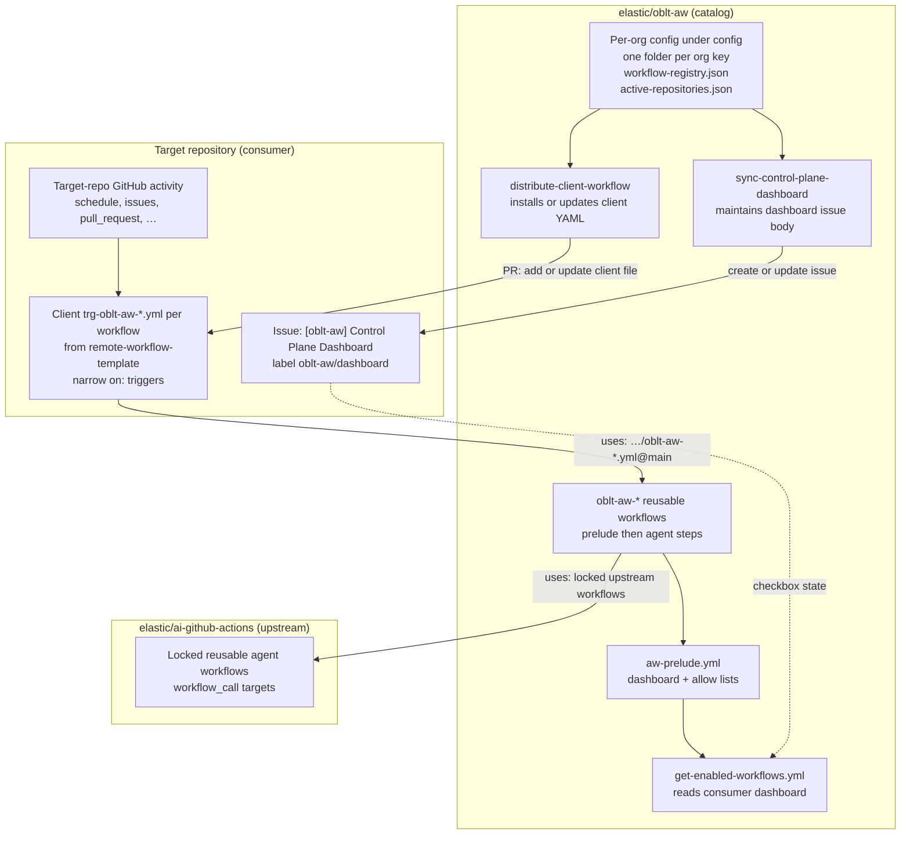
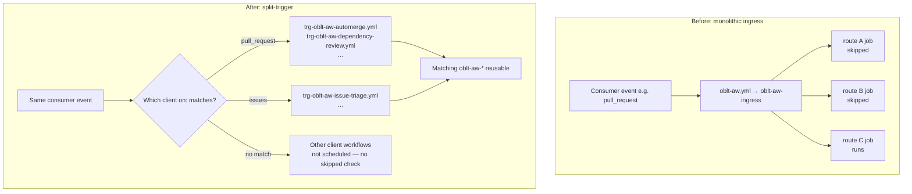
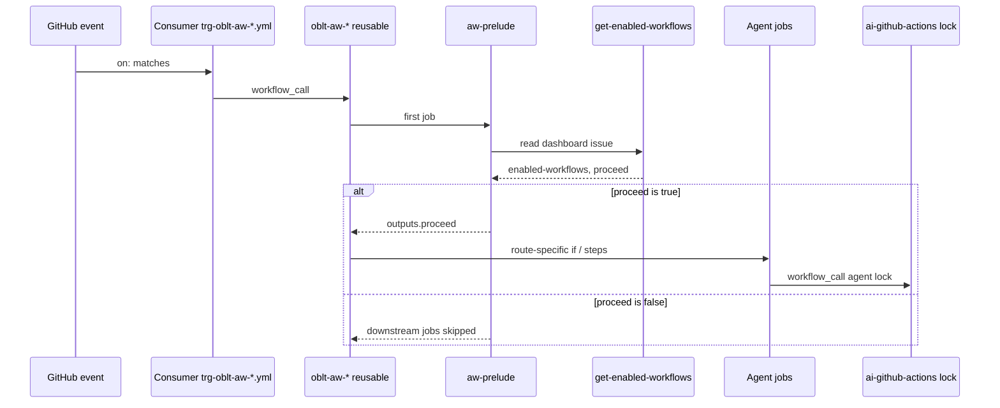
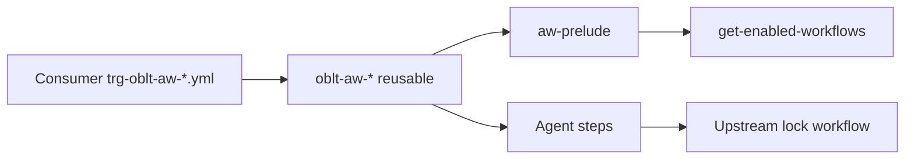

# OBLT AW Architecture Overview

## Overview

`oblt-aw` exposes reusable `oblt-aw-*` workflows. Each consumer installs one or more **`trg-oblt-aw-*.yml`** client templates (narrow `on:` triggers) that call the matching control-plane workflow. Shared dashboard gating and optional [APM agentic assets](./apm-agentic-assets.md) resolution run in [aw-prelude](../../.github/workflows/aw-prelude.yml) before agent-specific jobs.

Platform workflows:

- [.github/workflows/aw-prelude.yml](../../.github/workflows/aw-prelude.yml) (dashboard, allow lists, APM asset resolution)
- [.github/workflows/get-enabled-workflows.yml](../../.github/workflows/get-enabled-workflows.yml) (dashboard read; used by prelude)

Specialized workflows:

- [.github/workflows/oblt-aw-agent-suggestions.yml](../../.github/workflows/oblt-aw-agent-suggestions.yml)
- [.github/workflows/oblt-aw-autodoc.yml](../../.github/workflows/oblt-aw-autodoc.yml)
- [.github/workflows/oblt-aw-automerge.yml](../../.github/workflows/oblt-aw-automerge.yml)
- [.github/workflows/oblt-aw-dependency-review.yml](../../.github/workflows/oblt-aw-dependency-review.yml)
- [.github/workflows/oblt-aw-duplicate-issue-detector.yml](../../.github/workflows/oblt-aw-duplicate-issue-detector.yml)
- [.github/workflows/oblt-aw-issue-fixer.yml](../../.github/workflows/oblt-aw-issue-fixer.yml)
- [.github/workflows/oblt-aw-issue-triage.yml](../../.github/workflows/oblt-aw-issue-triage.yml)
- [.github/workflows/oblt-aw-mention-in-issue.yml](../../.github/workflows/oblt-aw-mention-in-issue.yml)
- [.github/workflows/oblt-aw-resource-not-accessible-by-integration-detector.yml](../../.github/workflows/oblt-aw-resource-not-accessible-by-integration-detector.yml)
- [.github/workflows/oblt-aw-resource-not-accessible-by-integration-fixer.yml](../../.github/workflows/oblt-aw-resource-not-accessible-by-integration-fixer.yml)
- [.github/workflows/oblt-aw-resource-not-accessible-by-integration-triage.yml](../../.github/workflows/oblt-aw-resource-not-accessible-by-integration-triage.yml)
- [.github/workflows/oblt-aw-security-detector.yml](../../.github/workflows/oblt-aw-security-detector.yml)
- [.github/workflows/oblt-aw-security-fixer.yml](../../.github/workflows/oblt-aw-security-fixer.yml)
- [.github/workflows/oblt-aw-security-triage.yml](../../.github/workflows/oblt-aw-security-triage.yml)

## Usage

Consumer repositories install per-workflow client templates (example):

```yaml
# .github/workflows/trg-oblt-aw-automerge.yml
on:
  pull_request:
    types: [opened, synchronize, reopened, labeled]
jobs:
  run-aw:
    uses: elastic/oblt-aw/.github/workflows/oblt-aw-automerge.yml@main
    secrets:
      COPILOT_GITHUB_TOKEN: ${{ secrets.COPILOT_GITHUB_TOKEN }}
```

## Control Plane and Consumer Interaction Diagram

The diagram below summarizes **how operators configure the platform in `elastic/oblt-aw`**, **how automation reaches target repositories**, and **how a run delegates** into reusable workflows in this catalog. Each target repository installs **`trg-oblt-aw-<workflow-id>.yml`** files from [remote-workflow-template/obs](../../.github/remote-workflow-template/obs/) with **event-specific `on:`** triggers; each client job calls the matching **`oblt-aw-*`** workflow, which runs **prelude** then agent steps.


```mermaid
flowchart TB
  subgraph OBLT["elastic/oblt-aw (catalog)"]
    CFG["Per-org config under config\none folder per org key\nworkflow-registry.json\nactive-repositories.json"]
    DIST["distribute-client-workflow\ninstalls or updates client YAML"]
    SYNC["sync-control-plane-dashboard\nmaintains dashboard issue body"]
    PRE["aw-prelude.yml\ndashboard + allow lists"]
    GET["get-enabled-workflows.yml\nreads consumer dashboard"]
    GHA["oblt-aw-* reusable workflows\nprelude then agent steps"]
    CFG --> DIST
    CFG --> SYNC
    PRE --> GET
    GHA --> PRE
  end

  subgraph UP["elastic/ai-github-actions (upstream)"]
    LOCK["Locked reusable agent workflows\nworkflow_call targets"]
  end

  subgraph CON["Target repository (consumer)"]
    EVT["Target-repo GitHub activity\nschedule, issues, pull_request, …"]
    CLIENT["Client trg-oblt-aw-*.yml per workflow\nfrom remote-workflow-template\nnarrow on: triggers"]
    DASH["Issue: [oblt-aw] Control Plane Dashboard\nlabel oblt-aw/dashboard"]
    EVT --> CLIENT
    DASH -.->|checkbox state| GET
  end

  DIST -->|PR: add or update client file| CLIENT
  SYNC -->|create or update issue| DASH
  CLIENT -->|uses: …/oblt-aw-*.yml@main| GHA
  GHA -->|uses: locked upstream workflows| LOCK
```

For event-level routing, see [docs/routing/README.md](../routing/README.md) and per-workflow routing docs.

### Split-trigger vs monolithic ingress

Monolithic ingress scheduled **every route as a sibling job** on a broad client trigger; jobs with `if: false` still appeared as **skipped** checks. Split-trigger clients schedule **only** workflows whose `on:` matches the event.


```mermaid
flowchart TB
  subgraph Before["Before: monolithic ingress"]
    B_EVT["Consumer event e.g. pull_request"]
    B_CLI["oblt-aw.yml → oblt-aw-ingress"]
    B_EVT --> B_CLI
    B_CLI --> B_SKIP1["route A job\nskipped"]
    B_CLI --> B_SKIP2["route B job\nskipped"]
    B_CLI --> B_RUN["route C job\nruns"]
  end

  subgraph After["After: split-trigger"]
    A_EVT["Same consumer event"]
    A_EVT --> A_MATCH{"Which client on: matches?"}
    A_MATCH -->|pull_request| A_PR["trg-oblt-aw-automerge.yml\ntrg-oblt-aw-dependency-review.yml\n…"]
    A_MATCH -->|issues| A_ISS["trg-oblt-aw-issue-triage.yml\n…"]
    A_MATCH -->|no match| A_NONE["Other client workflows\nnot scheduled — no skipped check"]
    A_PR --> A_REU["Matching oblt-aw-* reusable"]
    A_ISS --> A_REU
  end
```

### Single workflow run path

Each installed client file has one `run-aw` job. The reusable runs **prelude** first, then agent-specific jobs when `proceed` is true.


```mermaid
sequenceDiagram
  participant GH as GitHub event
  participant Client as Consumer trg-oblt-aw-*.yml
  participant Reuse as oblt-aw-* reusable
  participant Prelude as aw-prelude
  participant GET as get-enabled-workflows
  participant Agent as Agent jobs
  participant Up as ai-github-actions lock

  GH->>Client: on: matches
  Client->>Reuse: workflow_call
  Reuse->>Prelude: first job
  Prelude->>GET: read dashboard issue
  GET-->>Prelude: enabled-workflows, proceed
  alt proceed is true
    Prelude-->>Reuse: outputs.proceed
    Reuse->>Agent: route-specific if / steps
    Agent->>Up: workflow_call agent lock
  else proceed is false
    Prelude-->>Reuse: downstream jobs skipped
  end
```

## Control Plane Dashboard

The Control Plane Dashboard provides a self-service UI for repository users to opt in or opt out of each agentic workflow. It follows a Renovate Dependency Dashboard–style UX.

### Dashboard Issue

- **Location:** A single GitHub Issue per repository, created and maintained by the control-plane
- **Title:** `[oblt-aw] Control Plane Dashboard`
- **Label:** `oblt-aw/dashboard` (used for identification and routing)
- **Content:** Workflow list with maturity badges and checkboxes for opt-in/opt-out

### Config Flow

1. **Dashboard sync** (`sync-control-plane-dashboard`): Reads per-org `config/<org-key>/workflow-registry.json` and `active-repositories.json`; creates or updates the **single** dashboard issue in each target repository with sections per org; pins the issue when possible
2. **User edit:** Users check or uncheck workflow checkboxes in the dashboard issue (no config file; no PRs on checkbox edits)
3. **Runtime check** (`get-enabled-workflows`): When a `oblt-aw-*` workflow runs, prelude invokes this reusable workflow first. It parses the dashboard (or `effective-raw` is empty when no issue exists) and emits normalized `enabled-workflows`.
4. **Prelude gating:** Downstream jobs use `needs.prelude.outputs.proceed`; empty `effective-raw` → all workflows; empty array → none; non-empty array → only listed compound ids

### Opt-in / Opt-out

- **No dashboard exists:** All workflows are activated by default
- **Dashboard exists, all unchecked:** All workflows are deactivated
- **Dashboard exists, some checked:** Only checked workflows are executed

### References

- [docs/operations/control-plane-dashboard.md](../operations/control-plane-dashboard.md) — user instructions
- [docs/operations/control-plane-dashboard-format.md](../operations/control-plane-dashboard-format.md) — dashboard issue format
- [Multi-organization agentic workflows (design)](./multi-org-agentic-workflows.md) — parameterizing registries by `config/<org-key>/` (e.g. `config/obs/`), per-org active repositories, one shared dashboard with org-grouped workflows and org-inclusive checklist markers
- [Issue #3732 comment (implementation plan)](https://github.com/elastic/observability-robots/issues/3732#issuecomment-4054356635) — canonical plan

### Issues created by agentic workflows

Any issue opened by OBLT AW workflows must use a title that starts with `[oblt-aw]`. Wrapper workflows pass a `title-prefix` (or equivalent) to upstream agentic jobs so new issues stay searchable and consistent; the dashboard issue title is `[oblt-aw] Control Plane Dashboard`.

---

## Routing Model

Client templates declare **narrow** `on:` triggers; route-specific `if` conditions and dashboard gating live in **`oblt-aw-*`** (after prelude). See [docs/workflows/oblt-aw-client-template.md](../workflows/oblt-aw-client-template.md) and [docs/routing/README.md](../routing/README.md).

## Examples

See [Split-trigger vs monolithic ingress](#split-trigger-vs-monolithic-ingress) and [Single workflow run path](#single-workflow-run-path) above for diagrams. Minimal job graph:


```mermaid
flowchart LR
  A[Consumer trg-oblt-aw-*.yml] --> G[oblt-aw-* reusable]
  G --> P[aw-prelude]
  P --> B[get-enabled-workflows]
  G --> D[Agent steps]
  D --> L[Upstream lock workflow]
```

## References

- [docs/workflows/README.md](../workflows/README.md)
- [docs/routing/README.md](../routing/README.md)
