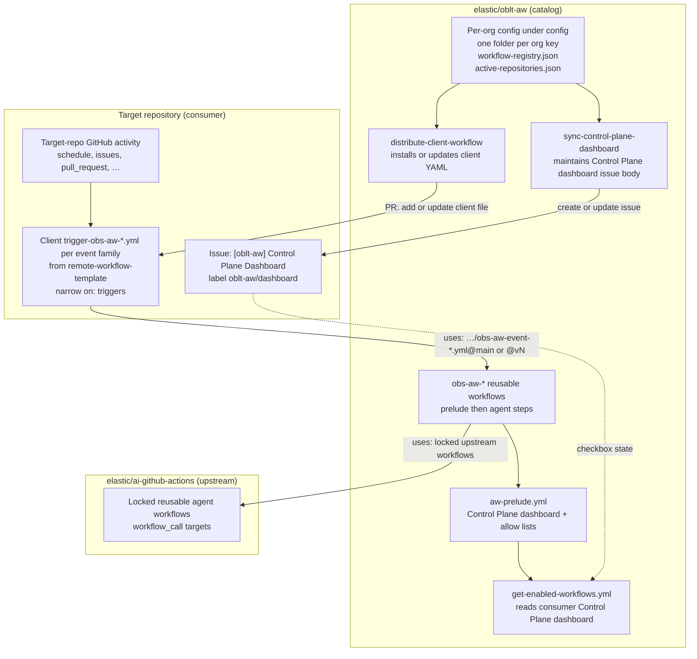
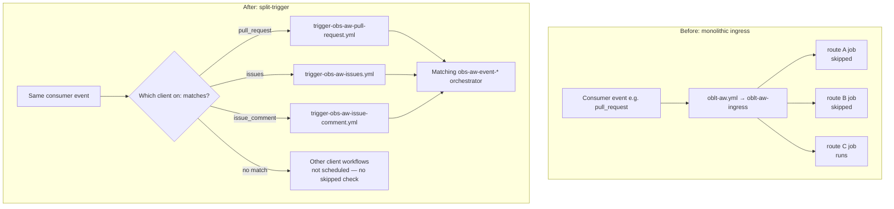
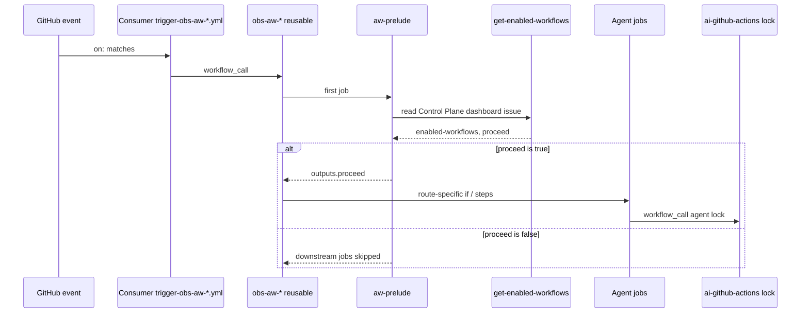
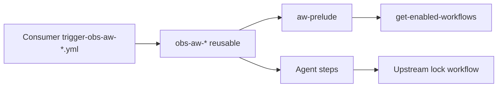

# OBLT AW Architecture Overview

## Overview

`oblt-aw` is an opinionated agentic framework that exposes reusable `obs-aw-*` workflows. Each consumer installs one or more **event-scoped** **`trigger-obs-aw-*.yml`** client templates (narrow `on:` triggers) that call the matching `obs-aw-event-*` orchestrator. Control-plane gating (Control Plane dashboard and allow lists) runs in [aw-prelude](https://github.com/elastic/oblt-aw/blob/main/.github/workflows/aw-prelude.yml). Optional [APM agentic assets](./apm-agentic-assets.md) resolution runs through [aw-resolve-agentic-assets](../workflows/aw-resolve-agentic-assets.md) once per `gh-aw-*` agent invocation, not inside the prelude.

Framework workflows:

- [.github/workflows/aw-prelude.yml](https://github.com/elastic/oblt-aw/blob/main/.github/workflows/aw-prelude.yml) (control plane: Control Plane dashboard, allow lists)
- [.github/workflows/aw-resolve-agentic-assets.yml](https://github.com/elastic/oblt-aw/blob/main/.github/workflows/aw-resolve-agentic-assets.yml) (APM asset resolution; once per agent job)
- [.github/workflows/get-enabled-workflows.yml](https://github.com/elastic/oblt-aw/blob/main/.github/workflows/get-enabled-workflows.yml) (Control Plane dashboard read; used by prelude)

Specialized workflows:

- [.github/workflows/obs-aw-agent-suggestions.yml](https://github.com/elastic/oblt-aw/blob/main/.github/workflows/obs-aw-agent-suggestions.yml)
- [.github/workflows/obs-aw-autodoc.yml](https://github.com/elastic/oblt-aw/blob/main/.github/workflows/obs-aw-autodoc.yml)
- [.github/workflows/obs-aw-automerge.yml](https://github.com/elastic/oblt-aw/blob/main/.github/workflows/obs-aw-automerge.yml)
- [.github/workflows/obs-aw-dependency-review.yml](https://github.com/elastic/oblt-aw/blob/main/.github/workflows/obs-aw-dependency-review.yml)
- [.github/workflows/obs-aw-duplicate-issue-detector.yml](https://github.com/elastic/oblt-aw/blob/main/.github/workflows/obs-aw-duplicate-issue-detector.yml)
- [.github/workflows/obs-aw-issue-fixer.yml](https://github.com/elastic/oblt-aw/blob/main/.github/workflows/obs-aw-issue-fixer.yml)
- [.github/workflows/obs-aw-issue-triage.yml](https://github.com/elastic/oblt-aw/blob/main/.github/workflows/obs-aw-issue-triage.yml)
- [.github/workflows/obs-aw-mention-in-issue.yml](https://github.com/elastic/oblt-aw/blob/main/.github/workflows/obs-aw-mention-in-issue.yml)
- [.github/workflows/obs-aw-resource-not-accessible-by-integration-detector.yml](https://github.com/elastic/oblt-aw/blob/main/.github/workflows/obs-aw-resource-not-accessible-by-integration-detector.yml)
- [.github/workflows/obs-aw-resource-not-accessible-by-integration-fixer.yml](https://github.com/elastic/oblt-aw/blob/main/.github/workflows/obs-aw-resource-not-accessible-by-integration-fixer.yml)
- [.github/workflows/obs-aw-resource-not-accessible-by-integration-triage.yml](https://github.com/elastic/oblt-aw/blob/main/.github/workflows/obs-aw-resource-not-accessible-by-integration-triage.yml)
- [.github/workflows/obs-aw-security-injection-detector.yml](https://github.com/elastic/oblt-aw/blob/main/.github/workflows/obs-aw-security-injection-detector.yml) (and supply-chain, secrets, least-privilege category detectors)
- [.github/workflows/obs-aw-security-issue-superseder.yml](https://github.com/elastic/oblt-aw/blob/main/.github/workflows/obs-aw-security-issue-superseder.yml)
- [.github/workflows/obs-aw-security-fixer.yml](https://github.com/elastic/oblt-aw/blob/main/.github/workflows/obs-aw-security-fixer.yml)
- [.github/workflows/obs-aw-security-triage.yml](https://github.com/elastic/oblt-aw/blob/main/.github/workflows/obs-aw-security-triage.yml)

## Usage

Consumer repositories install event-scoped client templates (example):

```yaml
# .github/workflows/trigger-obs-aw-pull-request.yml
on:
  pull_request:
    types: [opened, synchronize, reopened, labeled]
jobs:
  run-obs-aw-pull-request:
    uses: elastic/oblt-aw/.github/workflows/obs-aw-event-pull-request.yml@main
```

## Framework and consumer interaction diagram

The diagram below summarizes **how operators configure the framework in `elastic/oblt-aw`**, **how automation reaches target repositories**, and **how a run delegates** into reusable workflows in this catalog. Each target repository installs **event-scoped** **`trigger-obs-aw-<event>.yml`** files from [remote-workflow-template/obs](https://github.com/elastic/oblt-aw/tree/main/.github/remote-workflow-template/obs); each client job calls the matching **`obs-aw-event-*`** orchestrator, which runs **prelude** once then fans out to route workflows.


```mermaid
flowchart TB
  subgraph OBLT["elastic/oblt-aw (catalog)"]
    CFG["Per-org config under config\none folder per org key\nworkflow-registry.json\nactive-repositories.json"]
    DIST["distribute-client-workflow\ninstalls or updates client YAML"]
    SYNC["sync-control-plane-dashboard\nmaintains Control Plane dashboard issue body"]
    PRE["aw-prelude.yml\nControl Plane dashboard + allow lists"]
    GET["get-enabled-workflows.yml\nreads consumer Control Plane dashboard"]
    GHA["obs-aw-* reusable workflows\nprelude then agent steps"]
    CFG --> DIST
    CFG --> SYNC
    PRE --> GET
    GHA --> PRE
  end

  subgraph UP["elastic/ai-github-actions (upstream)"]
    LOCK["Locked reusable agent workflows\nworkflow_call targets"]
  end

  subgraph CON["Target repository (consumer)"]
    EVT["Target-repo GitHub activity\nschedule, issues, pull_request, …"]
    CLIENT["Client trigger-obs-aw-*.yml per event family\nfrom remote-workflow-template\nnarrow on: triggers"]
    DASH["Issue: [oblt-aw] Control Plane Dashboard\nlabel oblt-aw/dashboard"]
    EVT --> CLIENT
    DASH -.->|checkbox state| GET
  end

  DIST -->|PR: add or update client file| CLIENT
  SYNC -->|create or update issue| DASH
  CLIENT -->|uses: …/obs-aw-event-*.yml@main or @vN| GHA
  GHA -->|uses: locked upstream workflows| LOCK
```

For event-level routing, see [docs/routing/README.md](../routing/index.md) and per-workflow routing docs.

### Split-trigger vs monolithic ingress

Monolithic ingress scheduled **every route as a sibling job** on a broad client trigger; jobs with `if: false` still appeared as **skipped** checks. Split-trigger clients schedule **only** workflows whose `on:` matches the event.


```mermaid
flowchart TB
  subgraph Before["Before: monolithic ingress"]
    B_EVT["Consumer event e.g. pull_request"]
    B_CLI["oblt-aw.yml → oblt-aw-ingress"]
    B_EVT --> B_CLI
    B_CLI --> B_SKIP1["route A job\nskipped"]
    B_CLI --> B_SKIP2["route B job\nskipped"]
    B_CLI --> B_RUN["route C job\nruns"]
  end

  subgraph After["After: split-trigger"]
    A_EVT["Same consumer event"]
    A_EVT --> A_MATCH{"Which client on: matches?"}
    A_MATCH -->|pull_request| A_PR["trigger-obs-aw-pull-request.yml"]
    A_MATCH -->|issues| A_ISS["trigger-obs-aw-issues.yml"]
    A_MATCH -->|issue_comment| A_COM["trigger-obs-aw-issue-comment.yml"]
    A_MATCH -->|no match| A_NONE["Other client workflows\nnot scheduled — no skipped check"]
    A_PR --> A_REU["Matching obs-aw-event-* orchestrator"]
    A_ISS --> A_REU
    A_COM --> A_REU
  end
```

### Single workflow run path

Each installed client file has one event-scoped entrypoint job (for example `run-obs-aw-pull-request`). The reusable runs **`run-aw-prelude`** first, then agent-specific jobs when `proceed` is true.


```mermaid
sequenceDiagram
  participant GH as GitHub event
  participant Client as Consumer trigger-obs-aw-*.yml
  participant Reuse as obs-aw-* reusable
  participant Prelude as aw-prelude
  participant GET as get-enabled-workflows
  participant Agent as Agent jobs
  participant Up as ai-github-actions lock

  GH->>Client: on: matches
  Client->>Reuse: workflow_call
  Reuse->>Prelude: first job
  Prelude->>GET: read Control Plane dashboard issue
  GET-->>Prelude: enabled-workflows, proceed
  alt proceed is true
    Prelude-->>Reuse: outputs.proceed
    Reuse->>Agent: route-specific if / steps
    Agent->>Up: workflow_call agent lock
  else proceed is false
    Prelude-->>Reuse: downstream jobs skipped
  end
```

## Control Plane dashboard

The Control Plane dashboard provides a self-service UI for repository users to opt in or opt out of each agentic workflow. It follows a Renovate Dependency Dashboard–style UX.

### Control Plane dashboard issue

- **Location:** A single GitHub Issue per repository, created and maintained by the control plane
- **Title:** `[oblt-aw] Control Plane Dashboard`
- **Label:** `oblt-aw/dashboard` (used for identification and routing)
- **Content:** Workflow list with maturity badges and checkboxes for opt-in/opt-out

### Config Flow

1. **Control Plane dashboard sync** (`sync-control-plane-dashboard`): Reads per-org `config/<org-key>/workflow-registry.json` and `active-repositories.json`; creates or updates the **single** Control Plane dashboard issue in each target repository with sections per org; pins the issue when possible
2. **User edit:** Users check or uncheck workflow checkboxes in the Control Plane dashboard issue (no config file; no PRs on checkbox edits)
3. **Runtime check** (`get-enabled-workflows`): When a `obs-aw-*` workflow runs, prelude invokes this reusable workflow first. It parses the Control Plane dashboard (or `effective-raw` is empty when no issue exists) and emits normalized `enabled-workflows`.
4. **Prelude gating:** Downstream jobs use `needs.run-aw-prelude.outputs.proceed-by-workflow`; empty `effective-raw` or empty `enabled-workflows` → none; non-empty `enabled-workflows` → only listed compound ids

### Opt-in / Opt-out

- **No Control Plane dashboard exists:** All workflows are deactivated
- **Control Plane dashboard exists, all unchecked:** All workflows are deactivated
- **Control Plane dashboard exists, some checked:** Only checked workflows are executed

### References

- [docs/operations/control-plane-dashboard.md](../operations/control-plane-dashboard.md) — user instructions
- [docs/operations/control-plane-dashboard-format.md](../operations/control-plane-dashboard-format.md) — Control Plane dashboard issue format
- [Multi-organization agentic workflows (design)](./multi-org-agentic-workflows.md) — parameterizing registries by `config/<org-key>/` (e.g. `config/obs/`), per-org active repositories, one shared Control Plane dashboard with org-grouped workflows and org-inclusive checklist markers
- [QA](../knowledge-base/qa/index.md) — unit, integration, and E2E hubs
- [Agentic workflow testing platform (design)](./agentic-workflow-testing-platform.md) — unit through E2E layers, stochastic oracles, release gate contract ([#1877](https://github.com/elastic/oblt-aw/issues/1877))
- [Release](../knowledge-base/release.md) — promote train and consumer pins
- [Issue #3732 comment (implementation plan)](https://github.com/elastic/observability-robots/issues/3732#issuecomment-4054356635) — canonical plan

### Issues created by agentic workflows

Any issue opened by OBLT AW workflows must use a title that starts with `[oblt-aw]`. Wrapper workflows pass a `title-prefix` (or equivalent) to upstream agentic jobs so new issues stay searchable and consistent; the Control Plane dashboard issue title is `[oblt-aw] Control Plane Dashboard`.

---

## Routing Model

Client templates declare **narrow** `on:` triggers; route-specific `if` conditions and Control Plane dashboard gating live in **`obs-aw-*`** (after prelude). See [docs/workflows/obs-aw-client-template.md](../workflows/obs-aw-client-template.md) and [docs/routing/README.md](../routing/index.md).

## Examples

See [Split-trigger vs monolithic ingress](#split-trigger-vs-monolithic-ingress) and [Single workflow run path](#single-workflow-run-path) above for diagrams. Minimal job graph:


```mermaid
flowchart LR
  A[Consumer trigger-obs-aw-*.yml] --> G[obs-aw-* reusable]
  G --> P[aw-prelude]
  P --> B[get-enabled-workflows]
  G --> D[Agent steps]
  D --> L[Upstream lock workflow]
```

## References

- [docs/workflows/README.md](../workflows/index.md)
- [docs/routing/README.md](../routing/index.md)
