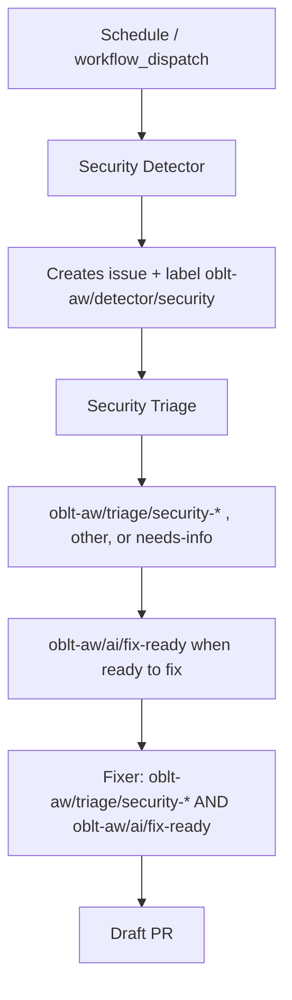

# Security Agent Architecture

## Overview

This document defines the architecture for proactive security bug hunting and remediation in oblt-aw. The design follows the detector–triage–fixer pattern, adapted for code-scanning use cases.

**Goal**: Move from reactive security reviews to continuous, automated security hardening of GitHub Actions and shell scripts.

**Scope**: Security detector, triage, and fixer workflows; ingress routing. The **ruleset** in `docs/workflows/security-scanning-ruleset.md` covers all **security focus areas** defined in [elastic/observability-robots#3758](https://github.com/elastic/observability-robots/issues/3758): (1) injection, (2) secret management, (3) supply chain, (4) least privilege. The detector implements that full ruleset, including SEC-001–SEC-003 and related patterns for token exposure and env indirection ([oblt-actions#500](https://github.com/elastic/oblt-actions/issues/500)).

**Out of scope**: Phase 4 learning/evolution features from that issue; changes to elastic/ai-github-actions beyond reusing published `workflow_call` workflows.

## Architecture

### Detector–Triage–Fixer Flow

The security agent pipeline follows this flow:

1. **Detector** — Scheduled or manually triggered. Scans code (shell scripts, workflow YAML) for security vulnerabilities. When it creates an issue (using the title prefix `[oblt-aw][security]`) for a finding, it must add the label `oblt-aw/detector/security` and include structured findings.
2. **Triage** — Triggered on issues labeled `oblt-aw/detector/security`. Classifies using `oblt-aw/triage/security-*` (injection, secrets, supply-chain, least-privilege), `oblt-aw/triage/other`, or `oblt-aw/triage/needs-info`. Produces a resolution plan where applicable. When an issue is ready for automated fix, triage adds `oblt-aw/ai/fix-ready` (the fixer path requires this together with a `oblt-aw/triage/security-*` label).
3. **Fixer** — Triggered on issues that have both `oblt-aw/triage/security-*` and `oblt-aw/ai/fix-ready`. Implements fixes per triage plan and opens draft PRs.

### Detector Implementation

The security detector must scan **code** (shell scripts, workflow YAML, and dependency manifests when present). No single upstream agent covers all of this today; the detector therefore runs **tooling and pattern checks** defined in the ruleset. It:

- Runs static analysis (shellcheck, grep/semgrep, optional ecosystem audits) per `docs/workflows/security-scanning-ruleset.md`.
- Aggregates findings and creates issues via API; every issue opened for a finding must include the label `oblt-aw/detector/security`.
- Reuses `gh-aw-issue-triage` and `gh-aw-issue-fixer` for triage and fixer stages.

## Tool Selection (aligned with #3758 Phase 1)

| Tool / check | Purpose | Target artifacts | Focus area |
|--------------|---------|------------------|------------|
| **shellcheck** | Shell quoting, unsafe constructs; supports command-injection heuristics | `.sh`, `.bash` | Injection |
| **grep / ripgrep** | Secret patterns, token-in-`run:`, logging of secrets | Workflows, scripts | Secret management |
| **semgrep** (or equivalent) | Expression/YAML injection patterns, `${{ secrets.* }}` in `run:` | `.yml` workflows | Injection + secrets |
| **Custom YAML walk** | `permissions:` analysis, unpinned `uses:`, risky triggers | `.github/workflows/**` | Least privilege + supply chain |
| **npm audit** / **pip-audit** / **govulncheck** (when lockfiles exist) | Known CVEs in dependencies | `package-lock.json`, Python/Go locks | Supply chain |
| **Pattern scripts** | Downloads without checksum verification | Shell scripts | Supply chain (integrity) |

**Complementary:** Repositories may enable **`gh-aw-dependency-review`** via oblt-aw ingress for PR-time dependency review; the detector’s SEC-033–SEC-035 rules still cover scheduled/repo-wide manifest checks.

### Implementation

The detector implements the full ruleset in `docs/workflows/security-scanning-ruleset.md`: secret-handling rules (SEC-001–SEC-003), injection (SEC-010–SEC-012), supply chain (SEC-030–SEC-035), and least privilege (SEC-040–SEC-044). [oblt-actions#500](https://github.com/elastic/oblt-actions/issues/500) is a reference for token exposure patterns addressed by SEC-001–SEC-003.

## Integration Points with elastic/ai-github-actions

| Stage | ai-github-actions Workflow | Usage |
|-------|----------------------------|-------|
| **Detector** | None (code-scanning) | Custom job runs shellcheck + grep/semgrep; creates issues. If a code-scanning agent is added later, oblt-aw can migrate to it. |
| **Triage** | `gh-aw-issue-triage.lock.yml` | Triggered for issues labeled `oblt-aw/detector/security`; classifies with `oblt-aw/triage/security-*`, `oblt-aw/triage/other`, or `oblt-aw/triage/needs-info`; adds `oblt-aw/ai/fix-ready` when ready to fix. |
| **Fixer** | `gh-aw-issue-fixer.lock.yml` | Triggered when a `oblt-aw/triage/security-*` label and `oblt-aw/ai/fix-ready` are present; security-specific instructions; least-privilege and env-indirection patterns. |

### Required Secret

- `COPILOT_GITHUB_TOKEN` — Required for detector, triage, and fixer (issue/PR creation and updates, API access).

### Inputs

- `target-repositories` — JSON array; default `[]` allows all; non-empty restricts triage/fixer to listed repositories.

## Deliverables

1. **Detector** — Workflow that checks out the caller repository and runs the checks defined in the ruleset for all applicable SEC-* rules (shellcheck, pattern scanners, optional ecosystem audits).
2. **Issues** — Created with prefix `[oblt-aw][security]` and label `oblt-aw/detector/security`.
3. **Triage** — Runs on `oblt-aw/detector/security` issues; applies granular `oblt-aw/triage/security-*` labels; adds `oblt-aw/ai/fix-ready` when appropriate.
4. **Fixer** — Produces draft PRs per triage plan (env indirection, pinning, permissions, and other remediations as specified).

**Coverage:** All rules in `docs/workflows/security-scanning-ruleset.md`, aligned with [elastic/observability-robots#3758](https://github.com/elastic/observability-robots/issues/3758). Token exposure via command-line args is one documented class ([oblt-actions#500](https://github.com/elastic/oblt-actions/issues/500)).

## Labels

| Label | Purpose |
|-------|---------|
| `oblt-aw/detector/security` | Applied by the detector on every issue it opens for a finding; triage ingress uses this label |
| `oblt-aw/triage/security-injection` / `…-secrets` / `…-supply-chain` / `…-least-privilege` | Triage: valid security finding in scope for remediation |
| `oblt-aw/triage/other` | Triage: not a security issue (or out of scope for this pipeline) |
| `oblt-aw/triage/needs-info` | Triage: insufficient information to classify or fix |
| `oblt-aw/ai/fix-ready` | Triage: ready for automated fix; fixer ingress requires this label together with a `oblt-aw/triage/security-*` label |

## Resolution Plan Structure (Triage Output)

Per triage, the resolution plan must include:

- **Root cause** — What vulnerability exists and where.
- **Risk assessment** — Severity and exposure.
- **Remediation steps** — Ordered actions to fix.
- **Before/after examples** — Code snippets showing current vs. fixed state.

## Fixer Requirements

- Requires both a `oblt-aw/triage/security-*` label and `oblt-aw/ai/fix-ready`.
- Draft PR first; convert to open after validation.
- Request review from `elastic/observablt-ci`.
- No auto-merge.
- Apply least-privilege and env-indirection patterns per triage plan.

## References

- [Parent issue: elastic/observability-robots#3758](https://github.com/elastic/observability-robots/issues/3758)
- [Security scanning ruleset](../workflows/security-scanning-ruleset.md)
- [Architecture overview](overview.md)
- [elastic/oblt-actions#500](https://github.com/elastic/oblt-actions/issues/500) — token exposure via CLI args
- [elastic/oblt-actions#495](https://github.com/elastic/oblt-actions/issues/495) — GH_TOKEN env injection
- [GitHub Actions security hardening](https://docs.github.com/en/actions/security-guides/security-hardening-for-github-actions)
