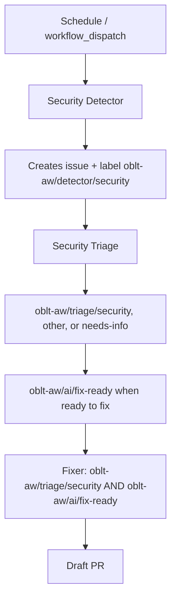

# Security Agent Architecture

## Overview

This document defines the architecture for proactive security bug hunting and remediation in oblt-aw. The design follows the detector–triage–fixer pattern, adapted for code-scanning use cases.

**Goal**: Move from reactive security reviews to continuous, automated security hardening of GitHub Actions and shell scripts.

**Scope**: Security detector, triage, and fixer workflows; ingress routing; PoC for one vulnerability class (token exposure via command-line args).

**Out of scope**: Phase 4 learning/evolution features; expansion beyond initial vulnerability classes; changes to elastic/ai-github-actions.

## Architecture

### Detector–Triage–Fixer Flow

The security agent pipeline follows this flow:

1. **Detector** — Scheduled or manually triggered. Scans code (shell scripts, workflow YAML) for security vulnerabilities. When it creates an issue for a finding, it must add the label `oblt-aw/detector/security` and include structured findings (for example title prefix `[oblt-aw][security]`).
2. **Triage** — Triggered on issues labeled `oblt-aw/detector/security`. Classifies using `oblt-aw/triage/security`, `oblt-aw/triage/other`, or `oblt-aw/triage/needs-info`. Produces a resolution plan where applicable. When an issue is ready for automated fix, triage adds `oblt-aw/ai/fix-ready` (the fixer path requires this together with `oblt-aw/triage/security`).
3. **Fixer** — Triggered on issues that have both `oblt-aw/triage/security` and `oblt-aw/ai/fix-ready`. Implements fixes per triage plan and opens draft PRs.

### Detector Implementation

The security detector must scan **code** (shell scripts, workflow YAML). No equivalent code-scanning agent exists in elastic/ai-github-actions today. The security detector will therefore:

- Run static analysis tools (shellcheck, grep/semgrep) in a custom job.
- Aggregate findings and create issues via API or agent invocation; every issue opened for a finding must include the label `oblt-aw/detector/security`.
- Reuse `gh-aw-issue-triage` and `gh-aw-issue-fixer` for triage and fixer stages (triage ingress must match issues with `oblt-aw/detector/security`).

## Tool Selection

| Tool | Purpose | Target Artifacts |
|------|---------|------------------|
| **shellcheck** | Shell script static analysis; detects quoting, injection, and best-practice violations | `.sh`, `.bash` scripts |
| **grep** | Pattern matching for token/secret exposure in command strings | `run:` blocks, script invocations |
| **semgrep** | Structural pattern matching for expression injection, `${{ secrets.* }}` in command strings | `.yml`, `.yaml` workflows |

### PoC Patterns (Token Exposure)

For the initial PoC (oblt-actions#500), focus on:

- **Token as positional argument**: Secrets passed as `$1`, `$2`, etc., visible in `/proc/*/cmdline`.
- **`${{ secrets.* }}` in command strings**: Direct secret interpolation in `run:` inline commands.
- **Recommendation**: Pass tokens via `env:` only; use environment variables in scripts.

## Integration Points with elastic/ai-github-actions

| Stage | ai-github-actions Workflow | Usage |
|-------|----------------------------|-------|
| **Detector** | None (code-scanning) | Custom job runs shellcheck + grep/semgrep; creates issues. If a code-scanning agent is added later, oblt-aw can migrate to it. |
| **Triage** | `gh-aw-issue-triage.lock.yml` | Triggered only for issues labeled `oblt-aw/detector/security`; classifies with `oblt-aw/triage/security`, `oblt-aw/triage/other`, or `oblt-aw/triage/needs-info`; adds `oblt-aw/ai/fix-ready` when ready to fix. |
| **Fixer** | `gh-aw-issue-fixer.lock.yml` | Triggered only when `oblt-aw/triage/security` and `oblt-aw/ai/fix-ready` are present; security-specific instructions; least-privilege and env-indirection patterns. |

### Required Secret

- `COPILOT_GITHUB_TOKEN` — Required for detector, triage, and fixer (issue/PR creation and updates, API access).

### Inputs

- `target-repositories` — JSON array; default `[]` allows all; non-empty restricts triage/fixer to listed repositories.

## PoC Scope

**Vulnerability class**: Token exposure via command-line args.

**Reference**: [elastic/oblt-actions#500](https://github.com/elastic/oblt-actions/issues/500) — Buildkite token passed as `$1` (positional argument), visible in `/proc/*/cmdline`. Recommendation: pass via environment variable only.

**PoC deliverables**:

1. Detector workflow that discovers shell scripts and workflow YAML, runs shellcheck and pattern checks for token exposure.
2. Issues created with prefix `[oblt-aw][security]` and label `oblt-aw/detector/security`.
3. Triage runs for issues with `oblt-aw/detector/security`; classifies with `oblt-aw/triage/security`, `oblt-aw/triage/other`, or `oblt-aw/triage/needs-info`; adds `oblt-aw/ai/fix-ready` when ready to fix.
4. Fixer runs for issues with `oblt-aw/triage/security` and `oblt-aw/ai/fix-ready`; produces draft PRs with env-indirection fixes.

## Labels

| Label | Purpose |
|-------|---------|
| `oblt-aw/detector/security` | Applied by the detector on every issue it opens for a finding; triage ingress uses this label |
| `oblt-aw/triage/security` | Triage: valid security finding in scope for remediation |
| `oblt-aw/triage/other` | Triage: not a security issue (or out of scope for this pipeline) |
| `oblt-aw/triage/needs-info` | Triage: insufficient information to classify or fix |
| `oblt-aw/ai/fix-ready` | Triage: ready for automated fix; fixer ingress requires this label together with `oblt-aw/triage/security` |

## Resolution Plan Structure (Triage Output)

Per triage, the resolution plan must include:

- **Root cause** — What vulnerability exists and where.
- **Risk assessment** — Severity and exposure.
- **Remediation steps** — Ordered actions to fix.
- **Before/after examples** — Code snippets showing current vs. fixed state.

## Fixer Requirements

- Requires both `oblt-aw/triage/security` and `oblt-aw/ai/fix-ready`.
- Draft PR first; convert to open after validation.
- Request review from `elastic/observablt-ci`.
- No auto-merge.
- Apply least-privilege and env-indirection patterns per triage plan.

## References

- [Implementation plan: issue #3758](docs/plans/issue-3758-security-agentic-workflows-plan.md)
- [Architecture overview](overview.md)
- [elastic/oblt-actions#500](https://github.com/elastic/oblt-actions/issues/500) — token exposure via CLI args
- [elastic/oblt-actions#495](https://github.com/elastic/oblt-actions/issues/495) — GH_TOKEN env injection
- [GitHub Actions security hardening](https://docs.github.com/en/actions/security-guides/security-hardening-for-github-actions)
