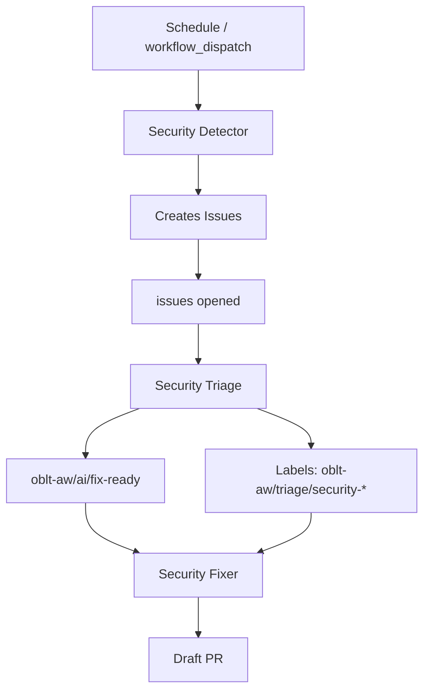

# Security Agent Architecture

## Overview

This document defines the architecture for proactive security bug hunting and remediation in oblt-aw. The design follows the detector–triage–fixer pattern established by the resource-not-accessible-by-integration workflows, adapted for code-scanning use cases.

**Goal**: Move from reactive security reviews to continuous, automated security hardening of GitHub Actions and shell scripts.

**Scope**: Security detector, triage, and fixer workflows; ingress routing; PoC for one vulnerability class (token exposure via command-line args).

**Out of scope**: Phase 4 learning/evolution features; expansion beyond initial vulnerability classes; changes to elastic/ai-github-actions.

## Architecture

### Detector–Triage–Fixer Flow

The security agent pipeline mirrors the resource-not-accessible-by-integration pattern:

1. **Detector** — Scheduled or manually triggered. Scans code (shell scripts, workflow YAML) for security vulnerabilities. Creates issues with structured findings.
2. **Triage** — Triggered on `issues` + `opened`. Classifies security issues, generates resolution plans, and labels fix-ready items.
3. **Fixer** — Triggered on `issues` + `labeled` when both `oblt-aw/ai/fix-ready` and a security triage label are present. Implements fixes per triage plan and opens draft PRs.

### Key Difference from Resource-Not-Accessible

The resource-not-accessible detector uses `gh-aw-log-searching-agent` to search workflow **logs** for error strings. The security detector must scan **code** (shell scripts, workflow YAML). No equivalent code-scanning agent exists in elastic/ai-github-actions today. The security detector will therefore:

- Run static analysis tools (shellcheck, grep/semgrep) in a custom job.
- Aggregate findings and create issues via API or agent invocation.
- Reuse `gh-aw-issue-triage` and `gh-aw-issue-fixer` for triage and fixer stages.

## Tool Selection

| Tool | Purpose | Target Artifacts |
|------|---------|------------------|
| **shellcheck** | Shell script static analysis; detects quoting, injection, and best-practice violations | `.sh`, `.bash` scripts |
| **grep** | Pattern matching for token/secret exposure in command strings | `run:` blocks, script invocations |
| **semgrep** | Structural pattern matching for expression injection, `${{ secrets.* }}` in command strings | `.yml`, `.yaml` workflows |

### PoC Patterns (Token Exposure)

For the initial PoC (oblt-actions#500), focus on:

- **Token as positional argument**: Secrets passed as `$1`, `$2`, etc., visible in `/proc/*/cmdline`.
- **`${{ secrets.* }}` in command strings**: Direct secret interpolation in `run:` inline commands.
- **Recommendation**: Pass tokens via `env:` only; use environment variables in scripts.

## Integration Points with elastic/ai-github-actions

| Stage | ai-github-actions Workflow | Usage |
|-------|----------------------------|-------|
| **Detector** | None (code-scanning) | Custom job runs shellcheck + grep/semgrep; creates issues. If a code-scanning agent is added later, oblt-aw can migrate to it. |
| **Triage** | `gh-aw-issue-triage.lock.yml` | Security-specific `additional-instructions`; labels `oblt-aw/triage/security-*`. |
| **Fixer** | `gh-aw-issue-fixer.lock.yml` | Security-specific instructions; least-privilege and env-indirection patterns. |

### Required Secret

- `COPILOT_GITHUB_TOKEN` — Required for detector and triage (issue creation, API access).

### Inputs

- `target-repositories` — JSON array; default `[]` allows all; non-empty restricts triage/fixer to listed repositories.

## PoC Scope

**Vulnerability class**: Token exposure via command-line args.

**Reference**: [elastic/oblt-actions#500](https://github.com/elastic/oblt-actions/issues/500) — Buildkite token passed as `$1` (positional argument), visible in `/proc/*/cmdline`. Recommendation: pass via environment variable only.

**PoC deliverables**:

1. Detector workflow that discovers shell scripts and workflow YAML, runs shellcheck and pattern checks for token exposure.
2. Issues created with prefix `[oblt-aw][security]`.
3. Triage labels: `oblt-aw/triage/security-secrets` (and related).
4. Fixer produces draft PRs with env-indirection fixes.

## Labels

| Label | Purpose |
|-------|---------|
| `oblt-aw/triage/security-injection` | Expression, command, or YAML injection |
| `oblt-aw/triage/security-secrets` | Secret/token management (PoC focus) |
| `oblt-aw/triage/security-supply-chain` | Supply chain (future) |
| `oblt-aw/triage/security-least-privilege` | Least privilege (future) |
| `oblt-aw/triage/other` | Unrelated to security |
| `oblt-aw/triage/needs-info` | Insufficient information |
| `oblt-aw/ai/fix-ready` | Triage complete; fixer may proceed |

## Resolution Plan Structure (Triage Output)

Per triage, the resolution plan must include:

- **Root cause** — What vulnerability exists and where.
- **Risk assessment** — Severity and exposure.
- **Remediation steps** — Ordered actions to fix.
- **Before/after examples** — Code snippets showing current vs. fixed state.

## Fixer Requirements

- Requires both `oblt-aw/ai/fix-ready` and one of `oblt-aw/triage/security-*`.
- Draft PR first; convert to open after validation.
- Request review from `elastic/observablt-ci`.
- No auto-merge.
- Apply least-privilege and env-indirection patterns per triage plan.

## References

- [Implementation plan: issue #3758](docs/plans/issue-3758-security-agentic-workflows-plan.md)
- [Architecture overview](overview.md)
- [elastic/oblt-actions#500](https://github.com/elastic/oblt-actions/issues/500) — token exposure via CLI args
- [elastic/oblt-actions#495](https://github.com/elastic/oblt-actions/issues/495) — GH_TOKEN env injection
- [GitHub Actions security hardening](https://docs.github.com/en/actions/security-guides/security-hardening-for-github-actions)
- [Resource-not-accessible detector](docs/workflows/gh-aw-resource-not-accessible-by-integration-detector.md)
- [Resource-not-accessible triage](docs/workflows/gh-aw-resource-not-accessible-by-integration-triage.md)
- [Resource-not-accessible fixer](docs/workflows/gh-aw-resource-not-accessible-by-integration-fixer.md)
