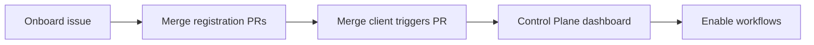

# Get started

Use this path if you are an Elastic developer and want agentic workflows in a repository through **oblt-aw**.



## 1. Onboard the repository

If the repository is **not** listed in `config/<org-key>/active-repositories.json` yet:

1. Open an **[Onboard a repository](https://github.com/elastic/oblt-aw/issues/new?template=onboard-repository.yml)** issue in [elastic/oblt-aw](https://github.com/elastic/oblt-aw).
2. Follow the agent checklist on the issue and merge the pull requests it opens.
3. Merge the agentic workflows triggers PR in your repository and confirm the Control Plane dashboard issue exists.

:::{image} images/onboard-repository-issue-form.png
:alt: Onboard a repository issue form with Repository and Organization key fields
:screenshot:
:::

For further details, see [Onboard a repository](user-guide/onboard-a-repository.md).

If the repository is **already** registered, skip to step 2.

## 2. Enable agentic workflows

1. Open the `[oblt-aw] Control Plane Dashboard` issue in your repository (GitHub label `oblt-aw/dashboard`). Sync pins it by default, so it usually appears at the top of the Issues list. If it is not pinned (for example when the repository already has three pinned issues), search with `label:oblt-aw/dashboard`.
2. Check the agentic workflow row. GitHub saves on click; the next matching event applies gating.

:::{image} images/pinned-control-plane-dashboard.png
:alt: Control Plane Dashboard issue pinned at the top of the repository Issues page
:screenshot:
:::

:::{image} images/find-control-plane-dashboard.png
:alt: Issues search filtered by label oblt-aw/dashboard showing the Control Plane Dashboard issue
:screenshot:
:::

:::{image} images/control-plane-dashboard-checkboxes.png
:alt: Enable/Disable checkboxes on the Control Plane dashboard
:screenshot:
:::

```bash
# Find the Control Plane dashboard in a consumer repository
gh issue list --repo elastic/<repo> --label oblt-aw/dashboard --state open
```

For further details, see [Enable or disable an agentic workflow](user-guide/enable-a-new-workflow.md).

## 3. Pick what agentic automation you need

Browse by what you want to automate: [Agentic workflow catalog by outcome](knowledge-base/agentic-workflows/by-outcome.md).

For Automerge dependency collections: [Choose Automerge dependency collections](user-guide/automerge-services.md).

More in the [User guide](user-guide/index.md).

## Where to get help

- Something broken: [Troubleshooting](troubleshooting/index.md) (checklists and [common problems](troubleshooting/common-problems/index.md))
- Slack: `#observability-robots` (operators and maintainers)
