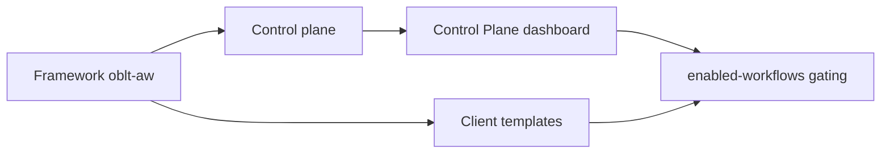

# Glossary

Shared vocabulary for **oblt-aw**. Prefer these names in docs and discussion so framework, control plane, and Control Plane dashboard stay distinct.

## Terms

### Agentic workflow

A registered automation unit in an org’s `workflow-registry.json` (compound id `org-key:workflow-id`). Consumers enable it from the Control Plane dashboard; when gated on, a client trigger runs the matching framework route (`obs-aw-*` / `docs-aw-*`).

See [Enable or disable an agentic workflow](user-guide/enable-a-new-workflow.md), [Workflow catalog by outcome](knowledge-base/agentic-workflows/by-outcome.md).

### Client template

A thin `trigger-*-aw-*.yml` workflow installed in a consumer repository. It declares a narrow GitHub `on:` trigger and calls a framework event orchestrator (`*-aw-event-*.yml`).

See [Client template](workflows/obs-aw-client-template.md), [Distribute client workflow](operations/distribute-client-workflow.md).

### Compound id

Canonical enablement string `org-key:workflow-id` (and optional `org-key:workflow-id:sub-feature-id`). Emitted in `enabled-workflows` and matched by Control Plane dashboard checkboxes and prelude gates.

See [Control Plane dashboard format](operations/control-plane-dashboard-format.md).

### Control plane

The configure-and-gate mechanism inside the framework: Control Plane dashboard, opt-in/opt-out, audit trail, and verification of requirements before agentic workflows run (for example [aw-prelude](workflows/aw-prelude.md)).

Not a synonym for **oblt-aw** as a whole.

See [Architecture overview](architecture/overview.md), [Control Plane dashboard](operations/control-plane-dashboard.md).

### Control Plane dashboard

The single GitHub issue per consumer repository (title `[oblt-aw] Control Plane Dashboard`, label `oblt-aw/dashboard`) with checkboxes to enable or disable agentic workflows. Synced by `sync-control-plane-dashboard` (pinned by default at the top of Issues); read at runtime by `get-enabled-workflows`.

:::{image} images/find-control-plane-dashboard.png
:alt: Issues search for label oblt-aw/dashboard showing the Control Plane Dashboard issue
:screenshot:
:::

See [Control Plane dashboard — user instructions](operations/control-plane-dashboard.md) (including how to find the pinned issue), [Sync Control Plane dashboard](workflows/sync-control-plane-dashboard.md).

### Dependency collection

A named Automerge sub-feature that groups dependency-update PRs by changed file paths (globs in [`config/obs/automerge-dependency-collections.json`](https://github.com/elastic/oblt-aw/blob/main/config/obs/automerge-dependency-collections.json)). On the Control Plane dashboard, each collection is an indented checkbox under Automerge (`obs:automerge:<collection-id>`). The collection gate classifies the PR and skips approve/merge when that collection is not enabled.

See [Automerge dependency collections](user-guide/automerge-services.md), [Automerge routing](routing/automerge-routing.md).

### Distribution

Framework automation that installs or updates client templates in repositories listed under `config/<org-key>/active-repositories.json`. Separate from the control plane (enablement and gating).

See [Distribute client workflow](operations/distribute-client-workflow.md).

### Framework (`oblt-aw`)

The opinionated agentic framework hosted in [elastic/oblt-aw](https://github.com/elastic/oblt-aw): reusable routes, client templates, distribution, per-org catalog (`config/<org-key>/`), and the control plane. Prefer **framework** or **oblt-aw** when you mean the whole product—not “control plane.”

See [Home](index.md), [Get started](get-started.md).

### Local AI assets

Repo-local agent customization declared in consumer `apm.yml` under `x-oblt-aw` (instructions, fragments, setup commands, optional APM packages). Resolved per agent invocation by [aw-resolve-agentic-assets](workflows/aw-resolve-agentic-assets.md); not required to enable workflows from the Control Plane dashboard.

See [Define local AI assets](user-guide/local-ai-assets.md), [APM agentic assets](architecture/apm-agentic-assets.md).

### Org key

Directory name under `config/<org-key>/` (for example `obs`, `docs`). Owns that org’s registry, active repositories, and allow lists. Appears in compound ids and Control Plane dashboard sections.

See [Multi-org design](architecture/multi-org-agentic-workflows.md).

### Prelude

Shared reusable workflow [`aw-prelude.yml`](workflows/aw-prelude.md) run once per event family. Reads the Control Plane dashboard, evaluates gates, and optionally loads bot allow lists before route jobs run. Part of the **control plane**.

See [aw-prelude](workflows/aw-prelude.md).

### Workflow registry

Per-org catalog file `config/<org-key>/workflow-registry.json`: workflow ids, maturity, defaults, docs paths, and `inner_workflows` basenames gated as one Control Plane dashboard unit.

See [Adopting a new remote agentic workflow](onboarding/adopting-agentic-workflows.md), [Workflow maturity](operations/workflow-maturity.md).
