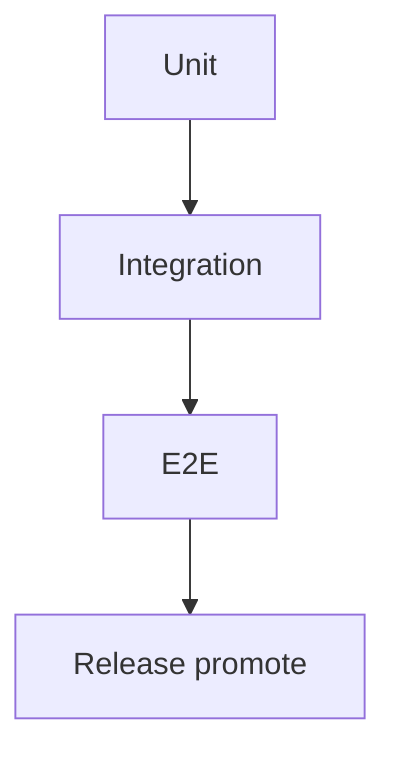

# QA

`oblt-aw` combines deterministic framework logic with stochastic agent runs. The testing platform covers that surface in layers: lower layers run on every PR; live E2E gates promote, not merge.

Design authority: [Agentic workflow testing platform](../../architecture/agentic-workflow-testing-platform.md).

## Layers

| Layer | What it proves | When it runs |
|-------|----------------|--------------|
| [Unit](unit.md) | Pure logic and contracts | Every PR |
| [Integration](integration.md) | Wrapper ↔ lock ↔ policy wiring without a live model | Every PR |
| [E2E](e2e.md) | Production-like agent path and observable side effects | Manual / promote (`e2e-all`) |

Functional checks (workflow validators, pre-commit, actionlint) sit alongside unit and integration on every PR. See [ci.yml](../../workflows/ci.md).

## Related

- [Release](../release.md) — promote consumes E2E as a mandatory gate
- Live harness notes: [Testing](../../testing/index.md)
