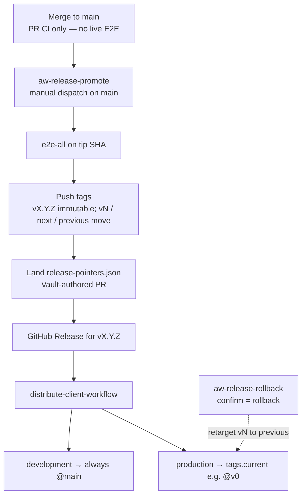

# Release

How framework changes move from `main` to production consumer pins, and how to roll back.

## Flow

1. Merge to `main` after PR CI (unit, functional, integration — not live E2E).
2. Manually dispatch [`aw-release-promote.yml`](../workflows/aw-release-promote.md) on the default branch with `release-type` (`patch` / `minor` / `major`).
3. Promote calls `e2e-all` on the tip SHA at dispatch, then tags, lands `config/release-pointers.json`, and creates a GitHub Release.
4. Distribute rewrites production installs to `tags.current` (for example `@v0`). Development repos stay on `@main`.

Rollback is a separate manual dispatch: [`aw-release-rollback.yml`](../workflows/aw-release-rollback.md) (confirm input must be `rollback`).

## Pins at a glance

| Class | Pin | Who |
|-------|-----|-----|
| `development` | Always `@main` | Pilot / early-detection repos, including `elastic/oblt-aw` |
| `production` | `tags.current` after promote | Everyone else in the active lists |

Template source under `.github/remote-workflow-template/` stays `@main`. Distribute substitutes the install pin from each repo’s `pin-class`.

## `release-pointers.json`

[`config/release-pointers.json`](https://github.com/elastic/oblt-aw/blob/main/config/release-pointers.json) is the committed record of which framework SHA and semver production consumers follow. Promote and rollback update it through a Vault-authored PR; do not hand-edit it on `main`.

| Field | Meaning |
|-------|---------|
| `major` | Production major line; first promote creates `v{major}.0.0` |
| `pointers.current` | SHA and immutable semver (`vX.Y.Z`) that production should track |
| `pointers.next` | Same SHA/semver as `current` after a normal promote (ops slot for a future staged train) |
| `pointers.previous` | Prior `current` (rollback target; a second rollback can swap back) |
| `schema_version` | Must be `1` |
| `tags.current` | Moving major tag **name** production installs use (for example `v0` → `@v0`) |
| `tags.next` / `tags.previous` | Moving ops tag names (`next`, `previous`) — not semver-shaped |

**Pointers vs tags:** each `pointers.*` entry stores a full SHA, immutable semver, and `updated_at`. The `tags.*` object only names the moving git tags. Distribute reads `tags.current` for production `uses:` pins once `pointers.current.sha` is set and that tag exists on origin.

**Order:** tags are pushed before the pointers PR merges, so distribute never rewrites production installs to a missing `@vN`.

Full field rules, bootstrap, and fail-closed checks: [Release model — release-pointers.json](../operations/release-model.md#release-pointersjson).

## Docs

| Topic | Doc |
|-------|-----|
| Distribution | [distribute-client-workflow](../operations/distribute-client-workflow.md) |
| Full model and runbook | [Release model](../operations/release-model.md) |
| Promote workflow | [aw-release-promote](../workflows/aw-release-promote.md) |
| `release-pointers.json` | [Release model — release-pointers.json](../operations/release-model.md#release-pointersjson) |
| Rollback workflow | [aw-release-rollback](../workflows/aw-release-rollback.md) |
| Testing contract (E2E gate) | [QA](qa/index.md) |
