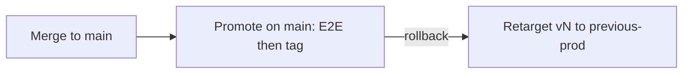

# Agentic workflow release model

**Status:** Implementation for [#1878](https://github.com/elastic/oblt-aw/issues/1878) (parent [#1879](https://github.com/elastic/oblt-aw/issues/1879)).
**Testing contract:** [agentic-workflow-testing-platform](../architecture/agentic-workflow-testing-platform.md).

## Goal

Promote control-plane changes safely with mandatory gating E2E, keep consumer trigger churn low (major bumps only), and support quick rollback.

## Current pins (inventory)

| Surface | Location | Pointer today |
|---------|----------|---------------|
| Distributed client triggers | `.github/remote-workflow-template/**/trigger-*-aw-*.yml` | `elastic/oblt-aw/.../obs-aw-event-*.yml@v0` (pre-stable moving major; pin only after `v0` / `v0.0.0` exist) |
| Control-plane self triggers | `.github/workflows/trigger-obs-aw-*.yml` | Relative `./.github/workflows/obs-aw-event-*.yml` (always tip of default branch) |
| Event orchestrators → routes | `obs-aw-event-*.yml` | Relative `./` (inherits caller pin) |
| In-repo GH-AW locks | `obs-aw-autodoc.yml`, `obs-aw-dependency-review.yml`, `obs-aw-estc-pr-buildkite-detective.yml` | Relative `./gh-aw-*.lock.yml` (inherits caller pin) |
| Upstream locks still in `ai-github-actions` | Other `obs-aw-*.yml` wrappers | `elastic/ai-github-actions/...@main` (until [#1876](https://github.com/elastic/oblt-aw/issues/1876)) |
| Release metadata | `config/release-pointers.json` | `prod` / `candidate` / `previous_prod` SHAs + semver |

**Why self triggers stay relative:** Live E2E on `elastic/oblt-aw` must exercise default-branch tip before promote. Distribute **skips** installing templates into the control-plane repository (`GITHUB_REPOSITORY`) so future `@v0` consumer pins never overwrite relative self-triggers.

## Target model (hybrid)

- **Shared train (default):** one moving major tag `v0` for all distributed clients while the promote train is proven.
- **Immutable audit tags:** `v0.x.y` created on each promote (never moved).
- **Moving ops tags:** `v0` (prod), `candidate`, `previous-prod`.
- **Graduation:** when the process is fully automated and testable, promote `major` → `v1.0.0`, bump templates to `@v1`, and redistribute.
- **Opt-in fine grain:** per-workflow pointers only when a route must promote independently (not implemented in the first slice; extend `release-pointers.json` when needed).

### Consumer churn

| Change type | Consumer action |
|-------------|-----------------|
| Patch / minor (compatible) | None — retarget `v0` after promote |
| Major / breaking (incl. graduate to `v1`) | Bump templates to `@v1` (or next major), redistribute |

## Automation vs human gates

| Step | Mode |
|------|------|
| Merge to `main` | Automated CI (unit, functional, integration) |
| Promote (`aw-release-promote.yml`) | Manual `workflow_dispatch` on `main` with `release-type` (`patch` / `minor` / `major`); calls `e2e-all` then tags tip |
| Rollback (`aw-release-rollback.yml`) | Manual; confirm input must be `rollback` |
| Major bump / model or security-sensitive changes | Human review before promote |

## Promote contract

1. Dispatch `aw-release-promote.yml` **on the default branch** (`main`).
2. Choose `release-type`: `patch`, `minor`, or `major`. First promote (empty prod pointer) always creates `v0.0.0` from `config/release-pointers.json` `major`.
3. Workflow calls `e2e-all` with `checkout-ref` set to `github.sha` (tip of `main` at promote start). Harness/oracle code is pinned to that SHA; live control-plane routes still exercise **default-branch tip** (relative self-triggers — intentional).
4. Before mutating tags, re-fetch and require `origin/main == github.sha`. If `main` advanced during E2E, promote aborts (re-run on the new tip).
5. On success: create immutable `vX.Y.Z` (no force-push), move `vX` / `candidate` / `previous-prod`, **commit and push** `config/release-pointers.json`, then push tags. Semver bumps from the **highest** pointer semver so rollback cannot rewind immutable numbering.

Standalone `e2e-all.yml` remains available for smoke without tagging (`checkout-ref` defaults to `main`).

## Quick rollback

| Item | Value |
|------|-------|
| Action | `aw-release-rollback.yml` on default branch only (confirm=`rollback`) |
| Effect | Retarget current `tags.prod` (`vN`) + `candidate` to `previous-prod` SHA; swap pointers |
| Semver after rollback | `prod` shows the restored release; next promote bumps from max(pointer semvers) |
| Cross-major | After a major promote, rollback moves the **new** major tag (`v1`, …), not the prior major |
| Who | Maintainers with Actions `workflow_dispatch` on this repo |
| Recovery target | **≤ 15 minutes** when git tags and `release-pointers.json` are healthy |
| Optional blast-radius stop | Disable routes via Control Plane Dashboard ([aw-prelude](../workflows/aw-prelude.md)) |

## First promote (after this model lands)

1. Merge the release-model PR to `main` (templates still pin `@main`).
2. Dispatch `aw-release-promote` on `main` with `release-type=patch` (first run → `v0` / `v0.0.0`).
3. Merge the follow-up PR that switches distributed client templates from `@main` → `@v0`, then redistribute to consumers.

## Scripts and workflows

| Path | Role |
|------|------|
| `config/release-pointers.json` | Source of truth for SHAs / semver |
| `scripts/release_pointers.py` | Library |
| `scripts/aw_release_promote.py` | Promote CLI |
| `scripts/aw_release_rollback.py` | Rollback CLI |
| `.github/workflows/aw-release-promote.yml` | Promote entrypoint (calls `e2e-all`) |
| `.github/workflows/aw-release-rollback.yml` | Rollback entrypoint |
| `.github/workflows/e2e-all.yml` | Parallel leaf E2E (promote + smoke) |

## References

- Issue: [#1878](https://github.com/elastic/oblt-aw/issues/1878)
- Testing platform: [agentic-workflow-testing-platform](../architecture/agentic-workflow-testing-platform.md)
- Distribution: [distribute-client-workflow](distribute-client-workflow.md)
- Client templates: [obs-aw-client-template](../workflows/obs-aw-client-template.md)
