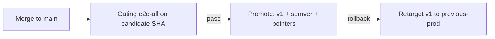

# Agentic workflow release model

**Status:** Implementation for [#1878](https://github.com/elastic/oblt-aw/issues/1878) (parent [#1879](https://github.com/elastic/oblt-aw/issues/1879)).
**Testing contract:** [agentic-workflow-testing-platform](../architecture/agentic-workflow-testing-platform.md).

## Goal

Promote control-plane changes safely with mandatory gating E2E, keep consumer trigger churn low (major bumps only), and support quick rollback.

## Current pins (inventory)

| Surface | Location | Pointer today |
|---------|----------|---------------|
| Distributed client triggers | `.github/remote-workflow-template/**/trigger-*-aw-*.yml` | `elastic/oblt-aw/.../obs-aw-event-*.yml@v1` (moving major) |
| Control-plane self triggers | `.github/workflows/trigger-obs-aw-*.yml` | Relative `./.github/workflows/obs-aw-event-*.yml` (always tip of default branch) |
| Event orchestrators → routes | `obs-aw-event-*.yml` | Relative `./` (inherits caller pin) |
| In-repo GH-AW locks | `obs-aw-autodoc.yml`, `obs-aw-dependency-review.yml`, `obs-aw-estc-pr-buildkite-detective.yml` | Relative `./gh-aw-*.lock.yml` (inherits caller pin) |
| Upstream locks still in `ai-github-actions` | Other `obs-aw-*.yml` wrappers | `elastic/ai-github-actions/...@main` (until [#1876](https://github.com/elastic/oblt-aw/issues/1876)) |
| Release metadata | `config/release-pointers.json` | `prod` / `candidate` / `previous_prod` SHAs + semver |

**Why self triggers stay relative:** Live E2E on `elastic/oblt-aw` must exercise default-branch tip before promote. Distribute **skips** installing templates into the control-plane repository (`GITHUB_REPOSITORY`) so `@v1` consumer pins never overwrite relative self-triggers.

## Target model (hybrid)

- **Shared train (default):** one moving major tag `v1` for all distributed clients.
- **Immutable audit tags:** `v1.x.y` created on each promote (never moved).
- **Moving ops tags:** `v1` (prod), `candidate`, `previous-prod`.
- **Opt-in fine grain:** per-workflow pointers only when a route must promote independently (not implemented in the first slice; extend `release-pointers.json` when needed).

### Consumer churn

| Change type | Consumer action |
|-------------|-----------------|
| Patch / minor (compatible) | None — retarget `v1` after promote |
| Major / breaking | Bump templates to `@v2`, redistribute |

## Automation vs human gates

| Step | Mode |
|------|------|
| Merge to `main` | Automated CI (unit, functional, integration) |
| Gating E2E (`e2e-all` with `candidate-ref`) | Manual dispatch (or future scheduled); **required** before promote |
| Promote (`aw-release-promote.yml`) | Manual `workflow_dispatch` after E2E run id is known |
| Rollback (`aw-release-rollback.yml`) | Manual; confirm input must be `rollback` |
| Major bump / model or security-sensitive changes | Human review before promote |

## E2E promote contract

1. Dispatch `e2e-all.yml` **on the candidate ref** with `candidate-ref=<full SHA>` (must equal `github.sha` of that run).
2. Every leaf stamps `summary.json` with `run_class: gating`, `candidate_ref`, `eligible_for_promote`.
3. Required workflow ids (all must pass): `obs:autodoc`, `obs:automerge`, `obs:dependency-review`, `obs:estc-pr-buildkite-detective`.
4. Smoke runs (empty `candidate-ref` or floating tip mismatch) set `eligible_for_promote: false` and **block** promote.
5. Promote downloads artifacts from the E2E run id and runs `scripts/aw_release_validate_e2e_gate.py`.

## Quick rollback

| Item | Value |
|------|-------|
| Action | `aw-release-rollback.yml` (confirm=`rollback`) |
| Effect | Move `v1` (+ `candidate`) to `previous-prod` SHA; swap pointers |
| Who | Maintainers with Actions `workflow_dispatch` on this repo |
| Recovery target | **≤ 15 minutes** when git tags and `release-pointers.json` are healthy |
| Optional blast-radius stop | Disable routes via Control Plane Dashboard ([aw-prelude](../workflows/aw-prelude.md)) |

## First bootstrap (after this model lands)

1. Merge the release-model PR to `main`.
2. Run gating `e2e-all` on that SHA with `candidate-ref` set.
3. Run `aw-release-promote` with `bootstrap=true`, the same SHA, semver `v1.0.0`, and the E2E run id — **before** merging distribute PRs that switch consumers to `@v1`.
4. Merge distribute PRs in consumer repos.

## Scripts and workflows

| Path | Role |
|------|------|
| `config/release-pointers.json` | Source of truth for SHAs / semver |
| `scripts/release_pointers.py` | Library |
| `scripts/aw_release_promote.py` | Promote CLI |
| `scripts/aw_release_rollback.py` | Rollback CLI |
| `scripts/aw_release_validate_e2e_gate.py` | Fail-closed E2E gate |
| `scripts/aw_release_stamp_summary.py` | Stamp leaf summaries |
| `.github/workflows/aw-release-promote.yml` | Promote entrypoint |
| `.github/workflows/aw-release-rollback.yml` | Rollback entrypoint |
| `.github/workflows/e2e-all.yml` | Parallel leaf E2E + `candidate-ref` |

## References

- Issue: [#1878](https://github.com/elastic/oblt-aw/issues/1878)
- Testing platform: [agentic-workflow-testing-platform](../architecture/agentic-workflow-testing-platform.md)
- Distribution: [distribute-client-workflow](distribute-client-workflow.md)
- Client templates: [obs-aw-client-template](../workflows/obs-aw-client-template.md)
