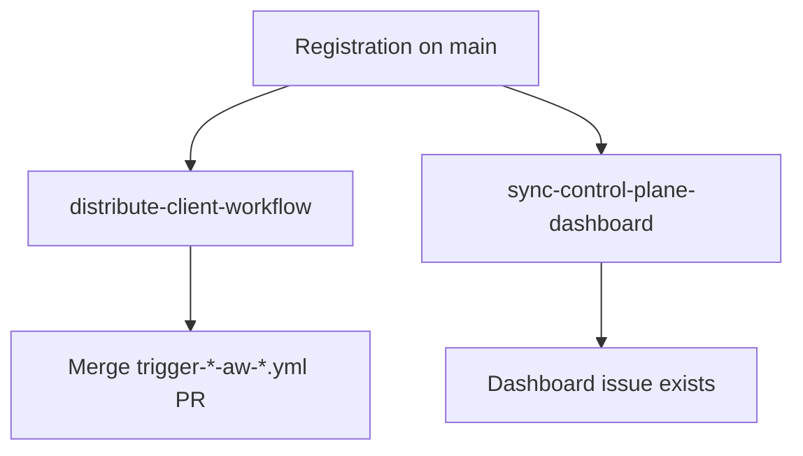

# Missing client template or Control Plane dashboard

## Symptom

The repository appears in `config/<org-key>/active-repositories.json` on `main`, but there is no client-template install PR and/or no `[oblt-aw] Control Plane Dashboard` issue.

## Cause

Post-registration automation creates the distribute PR and Control Plane dashboard sync from `main`. If the repo was never listed correctly, distribution/sync did not run, or the install PR was closed without merging, the consumer stays without clients or a Control Plane dashboard.



## Fix

1. Confirm the repository is listed in `config/<org-key>/active-repositories.json` on `main`.
2. Follow [distribute-client-workflow](../../operations/distribute-client-workflow.md) and [sync-control-plane-dashboard](../../workflows/sync-control-plane-dashboard.md).
3. Re-check the onboard path — [Onboard a repository](../../user-guide/onboard-a-repository.md).

   ```bash
   gh issue list --repo elastic/<repo> --label oblt-aw/dashboard --state open
   gh pr list --repo elastic/<repo> --search "trigger-obs-aw" --state open
   ```

   :::{image} ../../images/find-control-plane-dashboard.png
   :alt: Control Plane dashboard issue found via label filter
   :screenshot:
   :::

## See also

- [Troubleshoot an error](../troubleshoot-an-error.md)
- [Registering resources](../../onboarding/registering-a-repository.md)
