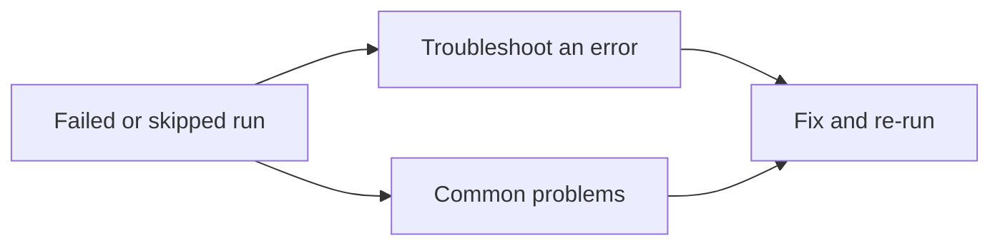

# Troubleshooting

Use these guides when a workflow run fails or a workflow does not run.

| Goal | Guide |
|------|--------|
| Work through a failed or skipped run | [Troubleshoot an error](troubleshoot-an-error.md) |
| Look up a known symptom | [Common problems](common-problems/index.md) |
| Decide if a repository secret is required vs ephemeral tokens | [Configure a GitHub secret](../admin-guide/configure-a-github-secret.md) |

## Common problems

| Problem | Start here |
|---------|------------|
| `create-token` / OIDC failures on client runs | [create-token or OIDC failures](common-problems/create-token-or-oidc-failures.md) |
| No distribute PR or no Control Plane dashboard after registration | [Missing client template or Control Plane dashboard](common-problems/missing-client-template-or-dashboard.md) |
| Onboard agent never comments or opens PRs | [Onboard agent no comment or PRs](common-problems/onboard-agent-no-comment-or-prs.md) |
| Registration merged before catalog TokenPolicy was active | [Registration before catalog TokenPolicy](common-problems/registration-before-catalog-token-policy.md) |
| Workflow jobs skipped or agents never run | [Workflows skipped or not running](common-problems/workflows-skipped-or-not-running.md) |
