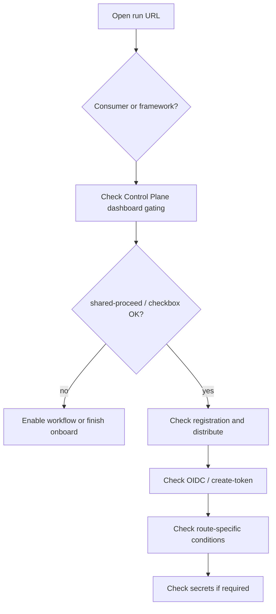

# Troubleshoot an error

## Overview

Use this checklist when a workflow run fails or a user reports that agentic workflows are not running. Work through the steps in order; each step points to the doc that owns the behavior.



## Prerequisites

- A GitHub Actions workflow run URL (or enough detail to find it: repository, workflow name, time).
- Read access to the consumer repository and, when the failure is in framework reusables, `elastic/oblt-aw`.

```bash
# Inspect a failed run (replace owner/repo and run-id)
gh run view <run-id> --repo elastic/<repo> --log-failed
```

## Steps

1. **Identify where the run lives** — Open the run URL.
   - **Consumer repo** (`trigger-obs-aw-*.yml`): start with the client template and event orchestrator. See [Client template index](../workflows/obs-aw-client-template.md).
   - **`elastic/oblt-aw`**: framework operation (distribution, CI) and control plane (Control Plane dashboard sync). See [docs/workflows/](../workflows/index.md) for the matching workflow doc.

2. **Check Control Plane dashboard gating** — If jobs were skipped or `shared-proceed` is false, the agentic workflow may not be enabled on the Control Plane dashboard.
   - Confirm an open Control Plane dashboard issue exists and the agentic workflow checkbox is checked. See [Control Plane dashboard](../operations/control-plane-dashboard.md).
   - Review [get-enabled-workflows](../workflows/get-enabled-workflows.md) and [aw-prelude](../workflows/aw-prelude.md) outputs (`effective-raw`, `enabled-workflows`, `proceed-by-workflow`).

   :::{image} ../images/find-control-plane-dashboard.png
   :alt: Issues search for the Control Plane dashboard by label oblt-aw/dashboard
   :screenshot:
   :::

   ```bash
   gh issue list --repo elastic/<repo> --label oblt-aw/dashboard --state open
   ```

3. **Check registration and distribution** — For new or recently registered repositories:
   - Repository listed in `config/<org-key>/active-repositories.json`? See [Registering resources](../onboarding/registering-a-repository.md).
   - Client templates installed via [distribute-client-workflow](../operations/distribute-client-workflow.md)?
   - Control Plane dashboard issue created via [sync-control-plane-dashboard](../workflows/sync-control-plane-dashboard.md)?

4. **Check permissions, OIDC, and ephemeral tokens** — Failures on `create-token` or OIDC often mean:
   - `workflow_ref` in the catalog token policy does not match the client trigger glob (expected `trigger-*-aw-*.yml@*`, not `@refs/heads/main` only).
   - The client `run-obs-aw-<event>` job is missing `id-token: write`. See [Client template index](../workflows/obs-aw-client-template.md).
   - Catalog policy was not merged before the `oblt-aw` registration merge.

   Expected client job permission (from the distributed pull-request trigger):

   ```yaml
   jobs:
     run-obs-aw-pull-request:
       permissions:
         id-token: write
         # ... plus contents, issues, pull-requests, and other grants
   ```

   Registration troubleshooting: [Registering resources — troubleshooting](../onboarding/registering-a-repository.md#troubleshooting). Maintainer detail: [Use GitHub ephemeral tokens](../admin-guide/use-gh-ephemeral-tokens.md).

5. **Check workflow-specific conditions** — After prelude gating, each route applies its own labels, comments, or allow lists. Open the workflow doc and routing doc:
   - Workflow catalog: [docs/workflows/README.md](../workflows/index.md)
   - Routing index: [docs/routing/README.md](../routing/index.md)

6. **Check secrets** — If the workflow doc declares repository secrets, confirm they are provisioned via [`elastic/observability-github-secrets`](https://github.com/elastic/observability-github-secrets). See [Configure a GitHub secret](../admin-guide/configure-a-github-secret.md).

## See also

- [Registering resources — troubleshooting](../onboarding/registering-a-repository.md#troubleshooting)
- [Adopting a new remote agentic workflow — troubleshooting](../onboarding/adopting-agentic-workflows.md#troubleshooting)
- [Control Plane dashboard — default behavior](../operations/control-plane-dashboard.md#default-behavior)
- [Troubleshooting index](index.md)
- [Common problems](common-problems/index.md)
