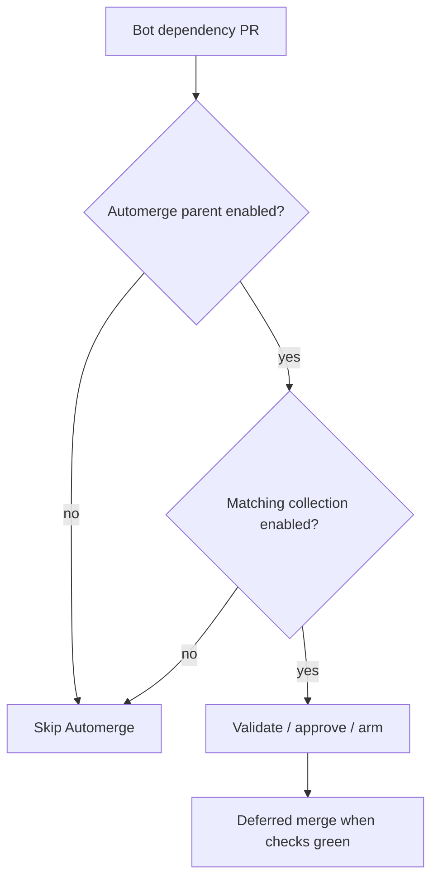

# Automerge dependency collections

## Overview

Automerge has two layers:

1. **Parent toggle:** turns Automerge on for the repository.
2. **Dependency collection checkboxes:** choose which dependency collections Automerge may merge.

This lets a team say: “We trust Automerge for these update types, but not for the rest.”

:::{image} ../images/control-plane-dashboard-checkboxes.png
:alt: Automerge parent checkbox with nested dependency collection checkboxes on the Control Plane dashboard
:screenshot:
:::

If a dependency collection is **enabled**, matching bot PRs can continue through the normal validation, approval, and merge flow (arm while required CI is pending; deferred merge on the frequent schedule profile). If a collection is **disabled**, those PRs stay unmerged; use the Automerge link on the Control Plane dashboard or the dependency-collection gate comment to review this catalogue and enable the right collection if you want it.



Technical details for eligibility, validation, approval, tokens, and merge behavior live in:

- [Automerge deferred (schedule)](../workflows/obs-aw-automerge-deferred.md)
- [Automerge routing](../routing/automerge-routing.md)
- [Automerge workflow](../workflows/obs-aw-automerge.md)

## What each dependency collection means

| Collection | What it covers | Representative files | Why enable it |
|------------|----------------|----------------------|---------------|
| APM CLI version | APM CLI pin updates for agent package install | `.apm.version`, `**/.apm.version`, `.apm-cli-pin/requirements.txt` | Keep the framework APM CLI pin current when Dependabot bumps `apm-cli` |
| GitHub Actions bumps | Version updates for GitHub Actions and composite actions | `.github/workflows/**`, `.github/actions/**`, `**/action.yml`, `**/action.yaml` | Keep CI actions current without hand-merging routine bumps |
| pre-commit hook updates | Dependency updates for pre-commit hooks | `.pre-commit-config.yaml` | Keep local and CI hook versions moving with low review overhead |
| Python dependencies | Python package and lockfile updates | `**/pyproject.toml`, `**/requirements.txt`, `**/requirements-*.txt`, `**/poetry.lock`, `**/Pipfile`, `**/Pipfile.lock` | Useful when Python bumps are routine and low risk for your repo |
| Go dependencies | Go module and sum updates | `go.mod`, `go.sum`, `**/go.mod`, `**/go.sum` | Good for teams that accept standard Go dependency refreshes automatically |
| Update beats | elastic-agent update-beats bumps | `NOTICE.txt`, `NOTICE-fips.txt`, `go.mod`, `go.sum`, `beats` | Helpful when update-beats changes are expected and well understood |
| Node dependencies | npm/yarn/pnpm manifest, lockfile, and JS bundled dist updates | `package.json`, `package-lock.json`, `yarn.lock`, `pnpm-lock.yaml`, `dist/**/*.cjs`, `dist/**/*.js`, `dist/**/*.js.map`, `dist/**/*.mjs`, `dist/licenses.txt`, `**/package.json`, `**/package-lock.json`, `**/yarn.lock`, `**/pnpm-lock.yaml`, `**/dist/**/*.cjs`, `**/dist/**/*.js`, `**/dist/**/*.js.map`, `**/dist/**/*.mjs`, `**/dist/licenses.txt` | Keep JavaScript dependency maintenance routine and predictable (including GitHub Actions that rebuild JS under `dist/`; not generic Go/goreleaser `dist/` trees) |
| Terraform / OpenTofu | Terraform, OpenTofu, and Terragrunt dependency updates | `**/*.tf`, `**/*.tfvars`, `**/*.tfvars.json`, `**/.terraform.lock.hcl`, `**/terragrunt.hcl`, `**/.opentofu-version`, `**/.terraform-version`, `**/.terragrunt-version` | Useful for infrastructure repos that want safe, routine IaC refreshes merged automatically |
| Open Policy Agent | Rego policies plus OPA version and configuration updates | `**/*.rego`, `**/.opa-version`, `**/opa.yaml`, `**/opa.yml` | Keep policy code and OPA tooling current while preserving review control elsewhere |
| VM / container images | CI runner, Docker/container, Compose, and snapshot-environment image-pin updates | `.buildkite/**`, `**/Dockerfile`, `**/Dockerfile.*`, `**/docker-compose.yml`, `**/docker-compose.yaml`, `testing/environments/snapshot.yml` | Handy when image-pin bumps are expected and you trust the matching automation path |
| Package version | `.package-version` bump automation | `.package-version`, `**/.package-version` | Useful for repos that treat version file bumps as routine automation |

Collection ids and globs are defined in [`config/obs/automerge-dependency-collections.json`](https://github.com/elastic/oblt-aw/blob/main/config/obs/automerge-dependency-collections.json). Example entry:

```json
{
  "id": "github-actions",
  "description": "GitHub Actions and composite action version bumps",
  "file-glob": [
    ".github/workflows/**",
    ".github/actions/**",
    "**/action.yml",
    "**/action.yaml"
  ]
}
```

On the Control Plane dashboard, that collection appears as an indented checkbox under Automerge (`obs:automerge:github-actions`).

## Choosing what to enable

- Start with the **parent Automerge toggle**.
- Enable only the dependency collections that match your repository.
- If you are unsure, leave a collection disabled until you are comfortable with the risk.

## Related Control Plane dashboard behavior

- The Control Plane dashboard shows each dependency collection with a concise label and description.
- The Control Plane dashboard's **Automerge** link opens this guide for collection selection, while the technical workflow and routing docs above cover implementation details.
- The checkbox marker is the real parsing contract; the visible text is for humans.
- Parent and dependency collection checkboxes are still subject to the normal Automerge workflow rules.
