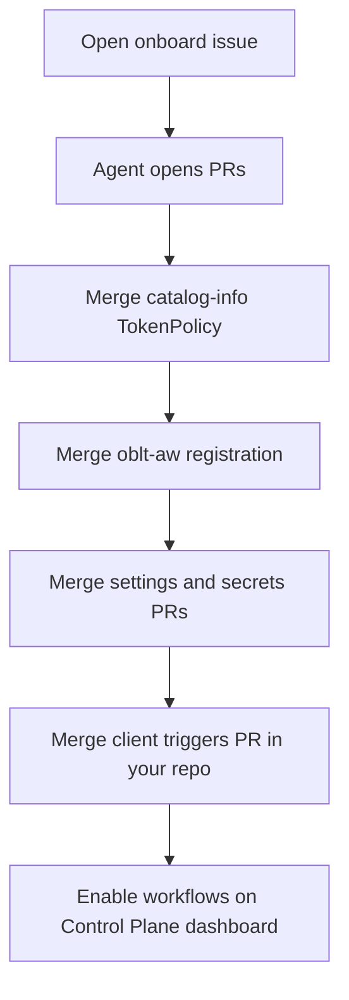

# Onboard a repository

## Overview

Use this guide when you want OBLT Agentic Workflows (`oblt-aw`) in a repository that is **not yet registered**. You open one issue in `elastic/oblt-aw`; automation opens the required pull requests; you merge them; then you enable agentic workflows from the Control Plane dashboard in your repository.



Technical registration detail for maintainers and agents: [Registering resources](../onboarding/registering-a-repository.md).

## Prerequisites

- The target repository is under the `elastic` GitHub organization.
- You have **write** access (or higher) on [elastic/oblt-aw](https://github.com/elastic/oblt-aw). Opening issues alone is not enough: GitHub only applies the form label when the creator has push access, and the agent role gate requires `write` / `maintain` / `admin`.
- You (or a teammate) can merge pull requests in [elastic/catalog-info](https://github.com/elastic/catalog-info), [elastic/oblt-aw](https://github.com/elastic/oblt-aw), [elastic/observability-github-settings](https://github.com/elastic/observability-github-settings), and—when needed—[elastic/observability-github-secrets](https://github.com/elastic/observability-github-secrets).

## Steps

1. **Open the onboard issue** — Use the **[Onboard a repository](https://github.com/elastic/oblt-aw/issues/new?template=onboard-repository.yml)** form (or pick it from [New issue](https://github.com/elastic/oblt-aw/issues/new/choose)).

   :::{image} ../images/onboard-repository-issue-form.png
   :alt: Onboard a repository issue form preview with Repository and Organization key fields
   :screenshot:
   :::

2. **Fill only two fields**
   - **Repository** — `elastic/<repo>` (example: `elastic/my-repo`).
   - **Organization key** — `obs` or `docs` (matches a `config/<org-key>/` folder in `elastic/oblt-aw`).

   ```text
   Repository:        elastic/my-repo
   Organization key:  obs
   ```

3. **Submit** — The form applies the label `oblt-aw/onboard/repository`. That starts the in-repo agent `gh-aw-onboard-repository` in `elastic/oblt-aw` only (this is **not** a consumer catalog / Control Plane dashboard agentic workflow).

4. **Wait for the agent checklist comment** — The agent posts progress on the issue and opens **separate, normal (non-draft) pull requests**, one concern per PR. Typical PRs:

   | Order | Repository | What it changes |
   |------:|------------|-----------------|
   | 1 | `elastic/catalog-info` | TokenPolicy for client `create-token` |
   | 2 | `elastic/oblt-aw` | Entry in `config/<org-key>/active-repositories.json` |
   | 3 | `elastic/observability-github-settings` | Vault app in classic BP `pull_request_bypassers` (and merge-queue ruleset `bypass_actors` when present) |
   | 4 | `elastic/observability-github-secrets` | When org agentic workflow docs’ **Prerequisites** (or **API / Interface**) require consumer secrets; otherwise the agent notes “none” |

   ```mermaid
   flowchart LR
     C1[catalog-info] --> C2[oblt-aw registration]
     C2 --> C3[settings]
     C3 --> C4[secrets if any]
   ```

5. **Merge manually in order** — Humans merge. Merge the **catalog-info** TokenPolicy PR **before** the **oblt-aw** registration PR. Merge settings (and secrets, if any) before relying on automerge or secret-backed agentic workflows in production. Auto-merge of these PRs is **out of scope** for now.

6. **After the oblt-aw registration PR merges to `main`** — Existing automation opens an agentic workflows triggers PR in your repository (`trigger-obs-aw-*.yml` or docs equivalents) via [distribute-client-workflow](../operations/distribute-client-workflow.md), and creates a **Control Plane dashboard** issue via [sync-control-plane-dashboard](../workflows/sync-control-plane-dashboard.md).

   Merge the agentic workflows triggers PR. Confirm the Control Plane dashboard issue exists (title `[oblt-aw] Control Plane Dashboard`, GitHub label `oblt-aw/dashboard`).

   :::{image} ../images/find-control-plane-dashboard.png
   :alt: Issues search for label oblt-aw/dashboard showing the Control Plane Dashboard issue
   :screenshot:
   :::

   ```bash
   gh issue list --repo elastic/<repo> --label oblt-aw/dashboard --state open
   ```

7. **Enable or disable agentic workflows** — In your repository, open the Control Plane dashboard issue and check or uncheck the agentic workflows you want. GitHub saves on click. Agentic workflows apply on the next supported client trigger. See [Enable or disable an agentic workflow](enable-a-new-workflow.md).

   :::{image} ../images/control-plane-dashboard-checkboxes.png
   :alt: Control Plane dashboard Enable/Disable checkboxes including Automerge dependency collections
   :screenshot:
   :::

## Troubleshooting

Full fixes live under [Troubleshooting](../troubleshooting/index.md). Quick links:

- **No agent comment / no PRs** (or retry after a partial run) — [Onboard agent no comment or PRs](../troubleshooting/common-problems/onboard-agent-no-comment-or-prs.md)
- **Registration merged too early** — [Registration before catalog TokenPolicy](../troubleshooting/common-problems/registration-before-catalog-token-policy.md)
- **No install PR or Control Plane dashboard** — [Missing client template or Control Plane dashboard](../troubleshooting/common-problems/missing-client-template-or-dashboard.md)
