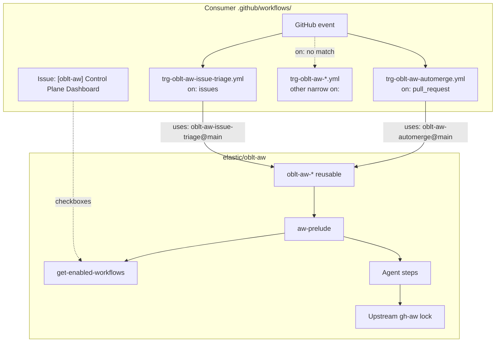

# Workflow: Client templates `trg-oblt-aw-*.yml`

## Overview

**Source of truth (edit here only):** [.github/remote-workflow-template/obs/.github/workflows/](../../.github/remote-workflow-template/obs/.github/workflows/)

## Split-trigger model

Each agentic workflow has its own client template under `trg-oblt-aw-<workflow-id>.yml` (or a descriptive suffix for multi-step features such as `trg-oblt-aw-security-triage.yml`). Each file declares **only** the GitHub events that can trigger that workflow, then calls the matching reusable workflow in `elastic/oblt-aw`:

```yaml
uses: elastic/oblt-aw/.github/workflows/oblt-aw-<name>.yml@main
```

That removes the large number of skipped ingress jobs on unrelated events (for example issue comments no longer run automerge, dependency-review, and security jobs).

Shared dashboard gating and allow-list loading run inside each `oblt-aw-*` workflow via [aw-prelude.yml](aw-prelude.md) (first job), not in the client file.

### Architecture



Full platform view (distribution, dashboard sync, before/after ingress): [architecture overview — split-trigger diagrams](../architecture/overview.md#split-trigger-vs-monolithic-ingress).

### Template index

| Client template | Triggers | Reusable workflow |
|-----------------|----------|-------------------|
| `trg-oblt-aw-agent-suggestions.yml` | `schedule` | `oblt-aw-agent-suggestions.yml` |
| `trg-oblt-aw-autodoc.yml` | `schedule` | `oblt-aw-autodoc.yml` |
| `trg-oblt-aw-automerge.yml` | `pull_request` (opened, synchronize, reopened, labeled) | `oblt-aw-automerge.yml` |
| `trg-oblt-aw-dependency-review.yml` | `pull_request` (opened, synchronize, reopened) | `oblt-aw-dependency-review.yml` |
| `trg-oblt-aw-duplicate-issue-detector.yml` | `issues` opened, `workflow_dispatch` | `oblt-aw-duplicate-issue-detector.yml` |
| `trg-oblt-aw-issue-triage.yml` | `issues` opened | `oblt-aw-issue-triage.yml` |
| `trg-oblt-aw-issue-fixer.yml` | `issue_comment` created | `oblt-aw-issue-fixer.yml` |
| `trg-oblt-aw-mention-in-issue.yml` | `issue_comment` created | `oblt-aw-mention-in-issue.yml` |
| `trg-oblt-aw-security-detector.yml` | `schedule`, `workflow_dispatch` | `oblt-aw-security-detector.yml` |
| `trg-oblt-aw-security-triage.yml` | `issues` opened, labeled | `oblt-aw-security-triage.yml` |
| `trg-oblt-aw-security-fixer.yml` | `issues` labeled | `oblt-aw-security-fixer.yml` |
| `trg-oblt-aw-resource-not-accessible-by-integration-detector.yml` | `schedule` | `oblt-aw-resource-not-accessible-by-integration-detector.yml` |
| `trg-oblt-aw-resource-not-accessible-by-integration-triage.yml` | `issues` opened, labeled | `oblt-aw-resource-not-accessible-by-integration-triage.yml` |
| `trg-oblt-aw-resource-not-accessible-by-integration-fixer.yml` | `issues` labeled | `oblt-aw-resource-not-accessible-by-integration-fixer.yml` |
| `trg-oblt-aw-estc-pr-buildkite-detective.yml` | `status` (Buildkite failure only, job `if`) | `oblt-aw-estc-pr-buildkite-detective.yml` |

Route-specific conditions (labels, `/ai` comment prefix, allow-listed PR authors, and so on) are enforced inside the `oblt-aw-*` reusable workflow after [aw-prelude](aw-prelude.md) runs.

## Configuration

Top-level permissions on every client template:

- `contents: read`

Job-level permissions on `run-aw` (must stay at least as permissive as nested reusable workflows):

- `actions: write`
- `checks: read`
- `contents: write`
- `discussions: write`
- `id-token: write`
- `issues: write`
- `pull-requests: write`

### Secrets

| Secret | Templates |
|--------|-----------|
| `COPILOT_GITHUB_TOKEN` | All except `trg-oblt-aw-issue-fixer.yml` and resource fixer (use `secrets: inherit` where noted in template) |
| `BUILDKITE_LOGS_API_TOKEN` → `BUILDKITE_API_TOKEN` | `trg-oblt-aw-estc-pr-buildkite-detective.yml` only |

## Migration from monolithic entrypoint

1. Merge distribution PRs that add `trg-oblt-aw-*.yml` files.
2. Delete `.github/workflows/oblt-aw.yml` and stop calling `oblt-aw-ingress` in the consumer repository. Remove any legacy per-workflow client files named `oblt-aw-*.yml` or `trigger-oblt-aw-*.yml` (without the `trg-` prefix); distribution drops paths that are no longer in the template tree.
3. Update Backstage `workflow_ref` / token policies to reference each installed **`trg-oblt-aw-*.yml`** client workflow file (one policy per workflow if your org requires narrow OIDC claims).

## References

- [docs/operations/distribute-client-workflow.md](../operations/distribute-client-workflow.md)
- [aw-prelude.md](aw-prelude.md)
