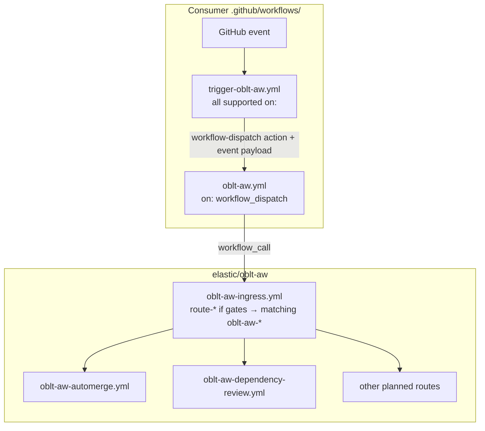

# Workflow: Client templates `trigger-oblt-aw.yml` and `oblt-aw.yml`

## Overview

**Source of truth (edit here only):** [.github/remote-workflow-template/obs/.github/workflows/](../../.github/remote-workflow-template/obs/.github/workflows/)

Consumer repositories install **two** client workflows:

| File | Role |
|------|------|
| `trigger-oblt-aw.yml` | Declares all supported GitHub events; one job dispatches the entrypoint via [`benc-uk/workflow-dispatch`](https://github.com/benc-uk/workflow-dispatch) and posts a PR commit status linking to the dispatched run |
| `oblt-aw.yml` | `workflow_dispatch` receiver; calls `elastic/oblt-aw/.github/workflows/oblt-aw-ingress.yml@main` with relayed event context |

Split per-workflow `trigger-oblt-aw-*.yml` files are **not** distributed anymore.

### Architecture

### Trigger events (`trigger-oblt-aw.yml`)

| Trigger | Types / notes |
|---------|----------------|
| `schedule` | `0 6 * * *` |
| `workflow_dispatch` | Manual replay |
| `issues` | `opened`, `labeled` |
| `issue_comment` | `created` |
| `pull_request` | `opened`, `synchronize`, `reopened`, `labeled` |
| `status` | Buildkite failure routing handled in ingress |

### Context relayed to `oblt-aw.yml`

| Input | Source |
|-------|--------|
| `trigger-source` | `github.workflow` |
| `event-name` | `github.event_name` |
| `event-action` | `github.event.action` |
| `event-payload-json` | `toJSON(github.event)` |
| `caller-ref` | `github.ref` |
| `caller-sha` | `github.sha` |
| `caller-run-id` | `github.run_id` |

### Permissions

**`trigger-oblt-aw.yml`**

| Scope | Job | Why |
|-------|-----|-----|
| `contents: read` | workflow root | Default |
| `actions: write` | `dispatch-entrypoint` | `GITHUB_TOKEN` — REST `workflow_dispatch` for `oblt-aw.yml` in the same repository |
| `statuses: write` | `dispatch-entrypoint` | `GITHUB_TOKEN` — PR commit status with link to dispatched `oblt-aw.yml` run |

The trigger uses `secrets.GITHUB_TOKEN` only (no `create-token`); same-repo dispatch and commit statuses do not need Backstage OIDC.

The dispatch step does **not** wait for `oblt-aw.yml` to finish. On `pull_request` events, a follow-up step posts commit status context `oblt-aw/entrypoint` on the PR head SHA with `target_url` set to the `runUrlHtml` output from `workflow-dispatch` (traceability only; `state: success` means dispatch succeeded, not that ingress or routed workflows completed). Do not add this context as a required check unless you intend to gate merges on dispatch alone.

**`oblt-aw.yml`**

| Scope | Job | Why |
|-------|-----|-----|
| `contents: read` | workflow root | Default |
| `actions: write` | `ingress` | Ingress may dispatch nested workflows |
| `id-token: write` | `ingress` | Ephemeral tokens in routed workflows |
| `issues: read` | `ingress` | Dashboard gating |
| `pull-requests: read` | `ingress` | Route planning for PR events |

### Secrets

| Secret | Templates |
|--------|-----------|
| `COPILOT_GITHUB_TOKEN` | `oblt-aw.yml` (forwarded to ingress and routed workflows) |
| `BUILDKITE_LOGS_API_TOKEN` | `oblt-aw.yml` → ingress as `BUILDKITE_API_TOKEN` (Buildkite detective route) |

## Migration from split triggers

1. Merge distribution PRs that install `trigger-oblt-aw.yml` and `oblt-aw.yml`.
2. Remove legacy `trigger-oblt-aw-*.yml` per-workflow client files (distribution `remove_files` handles drops).
3. Register Backstage `workflow_ref` for **`oblt-aw.yml`** (and routed control-plane workflows) when your vault model requires `create-token`; **`trigger-oblt-aw.yml` does not call `create-token`**.

## References

- [docs/operations/distribute-client-workflow.md](../operations/distribute-client-workflow.md)
- [oblt-aw-ingress.md](oblt-aw-ingress.md)
- [aw-prelude.md](aw-prelude.md)
