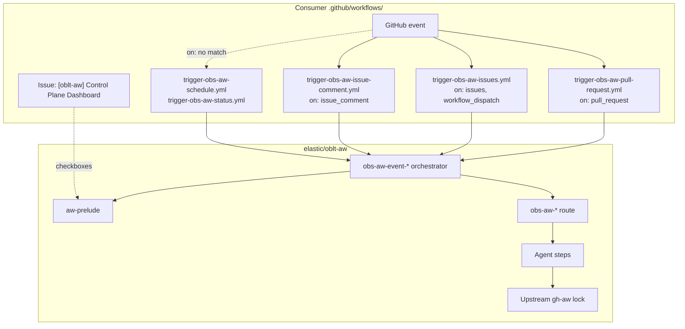

# Workflow: Client templates `trigger-obs-aw-*.yml`

## Overview

**Source of truth (edit here only):** [.github/remote-workflow-template/obs/.github/workflows/](../../.github/remote-workflow-template/obs/.github/workflows/)

## Event-scoped client model

Client templates are grouped by **GitHub event family** so co-triggered routes share one dashboard read and one allow-list load per workflow run. Each event-scoped client calls an orchestrator reusable (`obs-aw-event-*.yml`) that runs [aw-prelude.yml](aw-prelude.md) once, then fans out to per-route `obs-aw-*` workflows.

```yaml
uses: elastic/oblt-aw/.github/workflows/obs-aw-event-pull-request.yml@main
```

Per-route dashboard gating uses the required `shared-proceed` input (and related shared allow-list fields) passed from [aw-prelude.yml](aw-prelude.md) via each `obs-aw-event-*` orchestrator.

### Architecture



Full platform view (distribution, dashboard sync, before/after ingress): [architecture overview — split-trigger diagrams](../architecture/overview.md#split-trigger-vs-monolithic-ingress).

### Template index

| Client template | Triggers | Reusable workflow |
|-----------------|----------|-------------------|
| `trigger-obs-aw-pull-request.yml` | `pull_request` (opened, synchronize, reopened, labeled) | `obs-aw-event-pull-request.yml` → automerge, dependency-review |
| `trigger-obs-aw-issues.yml` | `issues` (opened, labeled), `workflow_dispatch` | `obs-aw-event-issues.yml` → issue-triage, duplicate-issue-detector, security superseder/triage/fixer, resource triage/fixer |
| `trigger-obs-aw-issue-comment.yml` | `issue_comment` created | `obs-aw-event-issue-comment.yml` → issue-fixer, mention-in-issue |
| `trigger-obs-aw-schedule.yml` | `schedule` (daily 06:00 UTC), `workflow_dispatch` | `obs-aw-event-schedule.yml` → agent-suggestions, autodoc, security category detectors, resource-not-accessible detector |
| `trigger-obs-aw-status.yml` | `status` (Buildkite failure only, job `if`) | `obs-aw-event-status.yml` → estc-pr-buildkite-detective |

Route-specific conditions (labels, `/ai` comment prefix, allow-listed PR authors, and so on) are enforced inside each `obs-aw-*` reusable workflow after prelude gating.

## Configuration

Top-level permissions on every client template:

- `contents: read`

Control-plane `obs-aw-*` workflows declare permissions on **each job** (workflow root is `contents: read` only). Jobs that call `gh-aw-*.lock.yml` should match the upstream lock workflow permissions.

Job-level permissions on the client entrypoint job (for example `run-obs-aw-pull-request`) must be at least as permissive as the union of all route jobs in the called event orchestrator (see table below).

| Client template | Entrypoint job id | Job permissions (union of callee jobs) |
|-----------------|-------------------|----------------------------------------|
| `trigger-obs-aw-pull-request.yml` | `run-obs-aw-pull-request` | `actions: read`, `contents: write`, `discussions: write`, `id-token: write`, `issues: write`, `pull-requests: write` |
| `trigger-obs-aw-issues.yml` | `run-obs-aw-issues` | `actions: read`, `contents: write`, `discussions: write`, `id-token: write`, `issues: write`, `pull-requests: write` |
| `trigger-obs-aw-issue-comment.yml` | `run-obs-aw-issue-comment` | `actions: read`, `contents: write`, `discussions: write`, `issues: write`, `pull-requests: write` |
| `trigger-obs-aw-schedule.yml` | `run-obs-aw-schedule` | `actions: read`, `contents: write`, `id-token: write`, `issues: write`, `pull-requests: write` |
| `trigger-obs-aw-status.yml` | `run-obs-aw-status` | `actions: read`, `contents: read`, `issues: read`, `pull-requests: write` |

### Secrets

| Secret | Templates |
|--------|-----------|
| `BUILDKITE_LOGS_API_TOKEN` → `BUILDKITE_API_TOKEN` | `trigger-obs-aw-status.yml` only |

## Migration from `trigger-oblt-aw-*` client templates

1. Merge distribution PRs that replace `trigger-oblt-aw-*.yml` with `trigger-obs-aw-*.yml` (same event-scoped set: pull-request, issues, issue-comment, schedule, status).
2. Distribution removes client paths that are no longer in the template tree (including retired `trigger-oblt-aw-*.yml`).
3. Update Backstage `workflow_ref` / token policies to reference the new client workflow files (for example `trigger-obs-aw-pull-request.yml`).

## Migration from monolithic entrypoint

1. Merge distribution PRs that add event-scoped `trigger-obs-aw-*.yml` files.
2. Delete `.github/workflows/oblt-aw.yml` and stop calling `oblt-aw-ingress` in the consumer repository. Remove any legacy per-workflow client files named `oblt-aw-*.yml`, `trigger-oblt-aw-*.yml`, or `trg-oblt-aw-*.yml`; distribution drops paths that are no longer in the template tree.
3. Update Backstage `workflow_ref` / token policies to reference each installed **`trigger-obs-aw-*.yml`** client workflow file.

## References

- [docs/operations/distribute-client-workflow.md](../operations/distribute-client-workflow.md)
- [aw-prelude.md](aw-prelude.md)
